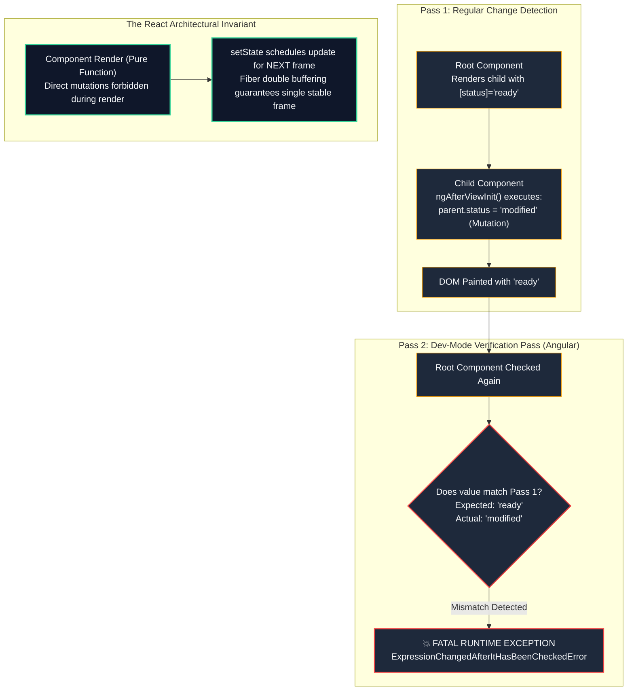

# 02: Angular Change Detection (Zone.js/Signals) vs React Reconciliation (Fiber)

---

## 1. Why This Topic Exists

The most fundamental architectural difference between modern frontend frameworks lies in how they answer a single question: **When the user interacts with the application, how does the engine figure out what DOM nodes need to change?**

In **Angular**, the answer has historically been **Ambient Dirty Checking driven by Zone.js**:
- Zone.js monkey-patches every asynchronous browser primitive (`setTimeout`, `Promise`, `addEventListener`, `fetch`).
- Whenever *any* asynchronous task completes anywhere in the browser, Zone.js alerts Angular, which triggers a top-down traversal across the entire component tree, evaluating template expressions against heap objects to see if values changed.
- In modern Angular (v16+), this model is evolving toward **Fine-Grained Signals**, where signal consumers track producers via a reactive dependency graph, enabling Zoneless change detection.

In **React**, the answer is **Explicit Scheduling & Fiber Reconciliation**:
- React never monkey-patches the browser. It has no ambient runtime listeners.
- React only wakes up when state is explicitly dispatched (`setState`, `dispatch`, `useActionState`).
- Instead of checking class properties, React re-executes the component function, generates a new Virtual DOM tree, diffs it against the persistent Fiber tree using heuristic rules, and schedules DOM mutations via cooperative time-slicing and 31-bit priority **Lanes**.

Understanding the mechanical physics of these two divergent engines is essential for an architect transitioning from Angular to React. It explains why Angular throws the dreaded `ExpressionChangedAfterItHasBeenCheckedError`, why React StrictMode double-invokes components, and how to optimize large enterprise applications for steady 60 FPS performance.

---

## 2. Learning Objectives

By the end of this chapter, you will be able to:
- Contrast the runtime physics of **Zone.js dirty checking** with **React Fiber tree reconciliation**.
- Deconstruct the two phases of React rendering: the interruptible **Render Phase** (`beginWork` / `completeWork`) and the synchronous **Commit Phase**.
- Explain why Angular throws `ExpressionChangedAfterItHasBeenCheckedError` and how React prevents similar desynchronization through functional purity.
- Compare bailout mechanics: Angular's `ChangeDetectionStrategy.OnPush` vs React's `React.memo` and Fiber `childLanes` pruning.
- Understand Angular 16+ Fine-Grained Signals and contrast them with React's coarse-grained component-level reactivity.
- Map browser change detection paradigms to WPF MVVM (`INotifyPropertyChanged`) and Blazor `StateHasChanged()`.

---

## 3. Historical Evolution

The quest for performant browser change detection has evolved across three major technological generations:

1. **The Full-Tree Dirty Checking Era (2010–2015):**
   AngularJS (v1.x) introduced the `$digest` loop. Every two-way binding registered a `$watch` expression. When an event occurred, Angular ran `$digest` repeatedly until all values stabilized (up to 10 iterations). In complex enterprise apps with 3,000+ watchers, the digest loop choked the browser main thread, causing severe UI freezes.
2. **The Zone.js & Virtual DOM Divergence (2015–2020):**
   - **Angular 2+** adopted **Zone.js** and unidirectional top-down change detection. It eliminated cyclic digest loops, running exactly once from root to leaf. To catch accidental feedback loops in development, Angular introduced a second verification pass, triggering `ExpressionChangedAfterItHasBeenCheckedError` if values mutated during the check.
   - **React** introduced **Fiber (React 16)**, replacing the synchronous recursive stack reconciler with a virtualized call stack implemented as a singly-linked tree on the V8 heap. This unlocked **Concurrent React**, cooperative time-slicing (5ms budgets), and priority scheduling.
3. **The Fine-Grained Reactivity & Compiler Era (2022–Present):**
   - **Angular 16–18** embraced **Signals**, moving toward fine-grained producer-consumer dependency graphs that notify specific template nodes directly, paving the path to eliminate Zone.js entirely.
   - **React 19** preserved coarse-grained component-level re-rendering, but introduced the **React Compiler (Forget)** to auto-memoize JSX subtrees at compile-time, eliminating manual `useMemo` and `useCallback` boilerplate.

---

## 4. First Principles & Intuitive Physical Analogies (Layer 1)

### The Building Security Guard vs The Automated Work Order Dispatcher

Imagine a 50-story corporate headquarters:
- **The Angular Model with Zone.js (The Hyperactive Security Guard):**
  - A security guard sits in the lobby with an ear to the ground (Zone.js). Whenever *any* sound happens—a telephone rings on Floor 4, a microwave beeps on Floor 30, or someone enters through the revolving door—the guard sounds an alarm.
  - An inspection team immediately runs through all 50 floors, knocking on every single office door: "Did your paperwork change? Did your paperwork change?"
  - If Floor 12 has an `OnPush` sign on the door, the inspectors only check that room if someone brought in a new briefcase (`@Input` changed) or the worker inside explicitly rang a bell.
- **The Modern Angular Signals Model (The Dedicated Intercom Wire):**
  - The CEO has a direct copper wire connected to a lightbulb on the CFO's desk. When the CEO flips the switch (`signal.set()`), only the CFO's bulb illuminates instantly. The inspectors never have to leave the lobby.
- **The React Model with Fiber (The Work Order Dispatcher):**
  - The headquarters has no security guards monitoring sounds. The building is quiet.
  - When a manager on Floor 14 wants to update an organizational chart, they submit an explicit electronic work order (`setEmployees()`).
  - The dispatcher stamps the order with an urgent or background priority lane. In the basement, draftspeople assemble a fresh blueprint on paper (Virtual DOM). If an urgent alarm rings (user types a keystroke), the draftsperson pauses drafting the chart, handles the keystroke immediately, and resumes the blueprint later. Once the blueprint is approved, workers execute surgical structural changes on the physical building in a single atomic sweep (Commit Phase).

---

## 5. Internal Working & Engine Architecture (Layer 2)

### Angular Change Detection Architecture (Zone.js & Signals)

```
[ ASYNC BROWSER EVENT (Click, Timer, Fetch) ]
                 |
                 v (Intercepted by Zone.js)
+-------------------------------------------------------------+
| Zone.js: onHasTask / onInvokeTask                           |
| Alerts Angular ApplicationRef via NgZone.onMicrotaskEmpty    |
+-------------------------------------------------------------+
                 |
                 v
+-------------------------------------------------------------+
| ApplicationRef.tick()                                       |
| Traverses the View Tree Top-Down (Root -> Children -> Leaves)|
|                                                             |
|   For each ViewRef:                                         |
|     - If Default: Evaluates all template expressions        |
|     - If OnPush: Checks if inputs changed (Object.is)       |
|                  or if ChangeDetectorRef.markForCheck() set  |
|                                                             |
|   DEV MODE SECOND PASS (Verification Loop):                 |
|     - Re-evaluates all template expressions                 |
|     - If value !== previousValue -> THROWS ERROR:           |
|       ExpressionChangedAfterItHasBeenCheckedError           |
+-------------------------------------------------------------+
```

### React Fiber Reconciliation Architecture (Scheduler & Reconciler)

```
[ EXPLICIT STATE TRIGGER (setState / dispatch) ]
                 |
                 v
+-------------------------------------------------------------+
| 1. SCHEDULER & PRIORITY LANES                               |
|    - Assigns update to a 31-bit Lane (Urgent vs Transition) |
|    - Schedules work loop via MessageChannel macrotask       |
+-------------------------------------------------------------+
                 |
                 v
+-------------------------------------------------------------+
| 2. RENDER PHASE (Interruptible, Cooperative Time-Slicing)   |
|    - Double-Buffering: workInProgress tree clone            |
|    - beginWork(): Traverses Fiber down; invokes Component() |
|      * Checks if oldProps === newProps & no Lane updates   |
|      * BAILOUT: Skips component subtree (childLanes check)  |
|    - Diffing Algorithm: Reconciles VDOM against current     |
|    - completeWork(): Bubbles child flags up; creates DOM    |
|    - Frame budget: 5ms. Yields to main thread if expired    |
+-------------------------------------------------------------+
                 |
                 v
+-------------------------------------------------------------+
| 3. COMMIT PHASE (Synchronous, Uninterruptible)              |
|    - Atomic pointer swap: fiberRoot.current = workInProgress|
|    - Mutation: Applies physical DOM updates                 |
|    - Layout Effects: Executes useLayoutEffect synchronously |
|    - Passive Effects: Schedules useEffect on microtask      |
+-------------------------------------------------------------+
```

---

## 6. Runtime Flow & Execution Traces

Let us compare how both engines handle a user clicking a counter button:

### The Angular Execution Trace (Zone.js)

```
1. User clicks <button (click)="increment()">
2. Browser fires native 'click' event
3. Zone.js patched addEventListener intercepts the callback
4. Component method runs: this.count++ (mutates in-place on heap)
5. Task completes -> Zone.js notifies NgZone
6. NgZone emits onMicrotaskEmpty
7. ApplicationRef.tick() triggered
8. View tree checked top-down:
   - RootComponent checked (no changes)
   - HeaderComponent checked (no changes)
   - CounterComponent checked: count was 0, now 1 -> DOM <span> updated to "1"
9. Dev mode second pass confirms count is still 1
10. Tick completes
```

### The React Execution Trace (Fiber)

```
1. User clicks <button onClick={handleIncrement}>
2. React SyntheticEvent wrapper dispatches handler
3. Handler executes: setCount(prev => prev + 1)
4. React enqueues update into Fiber.updateQueue with SyncLane
5. ensureRootIsScheduled() requests work loop execution
6. Render Phase begins:
   - CounterComponent Fiber entered via beginWork()
   - CounterComponent({ count }) re-executed as pure function
   - useState() retrieves updated value (1) from memoizedState
   - Returns new JSX Element: <span>1</span>
   - Diffing identifies text content mutation flag (Update)
   - completeWork() bubbles flags to parent
7. Commit Phase begins:
   - Swaps FiberRoot pointer to workInProgress tree
   - DOM node updated: span.textContent = "1"
8. Passive useEffect callbacks fired
```

---

## 7. Memory Model & Heap Layout

```
ANGULAR HEAP MODEL (Class Instances & ViewRefs):
+---------------------------------------------------------------+
| V8 Heap (Persistent Class Instances)                          |
|                                                               |
|  [ CounterComponent Instance (0x00B1) ]                       |
|    ├── count: 1 (Mutable primitive field)                     |
|    ├── __ngContext__: [ ViewRef Pointer, LView Array ]        |
|    └── changeDetectorRef: ViewRef { dirty: false }            |
|                                                               |
|  * The object instance 0x00B1 remains alive across all events |
+---------------------------------------------------------------+

REACT HEAP MODEL (Double Buffering Fiber Architecture):
+---------------------------------------------------------------+
| V8 Heap (Double-Buffered Fiber Tree)                          |
|                                                               |
|  [ Current Fiber ]                 [ WorkInProgress Fiber ]   |
|  (Screen Representation)           (Background Scratchpad)    |
|  ├── memoizedState: 0              ├── memoizedState: 1       |
|  ├── stateNode: <span>0</span>     ├── alternate: Current     |
|  └── alternate: WIP -------------->├── flags: Update          |
|                                                               |
|  * Atomic pointer swap: fiberRoot.current = WIP              |
|  * Old Fiber recycled in next update without GC pressure      |
+---------------------------------------------------------------+
```

---

## 8. Visual Diagrams (ASCII / Text)

### The ExpressionChangedAfterItHasBeenCheckedError Explained



<details className="raw-schematic-details">
<summary>📄 View Raw Comparison Schematic</summary>

```
ANGULAR UNIDIRECTIONAL DATA FLOW VIOLATION:

Pass 1: Regular Change Detection
Root Component
  │  (Renders Child with property [status]="'ready'")
  ▼
Child Component
  │  ngAfterViewInit() executes:
  │  this.parent.status = 'modified';  <--- ANTIPATTERN: Mutating parent during check!
  ▼
DOM Updated with 'ready'

-------------------------------------------------------------------------
Pass 2: Dev-Mode Verification Check (Angular Development Only)
Root Component re-evaluated:
  Status was reported as 'ready' in Pass 1,
  but is now read as 'modified' in Pass 2!

  💥 FATAL RUNTIME EXCEPTION:
  ExpressionChangedAfterItHasBeenCheckedError:
  Expression has changed after it was checked.
  Previous value: 'ready'. Current value: 'modified'.

-------------------------------------------------------------------------
WHY THIS NEVER HAPPENS IN REACT:
React enforces functional purity. Components are not permitted to mutate
parent state during their render execution pass.
Mutations are dispatched to future render passes:
setParentStatus('modified') schedules a subsequent update,
guaranteeing complete frame consistency without runtime exceptions.
```

</details>

---

## 9. Real World Usage & Production Patterns

> 🧪 **Companion Interactive Lab:** [CanvasDesignLab.tsx](../../apps/portal/src/features/visualizers/topic-11-system-design/CanvasDesignLab.tsx) | Live in Portal: topic-11-system-design

### Side-by-Side Architectural Transformation: Bailout Strategies

Below is an enterprise comparison illustrating how both frameworks skip unnecessary component subtree computations:

#### 1. The Angular Bailout Pattern (`OnPush` Strategy)

```typescript
// Angular OnPush Strategy
import { Component, Input, ChangeDetectionStrategy, ChangeDetectorRef, inject } from '@angular/core';
import { CommonModule } from '@angular/common';

export interface MarketQuote {
  symbol: string;
  price: number;
}

@Component({
  selector: 'app-quote-row',
  standalone: true,
  imports: [CommonModule],
  changeDetection: ChangeDetectionStrategy.OnPush, // Skips tree check unless Input ref changes
  template: `
    <div class="row">
      <span>{{ quote.symbol }}</span>
      <span>\${{ quote.price.toFixed(2) }}</span>
      <button (click)="refreshLocal()">Check</button>
    </div>
  `
})
export class QuoteRowComponent {
  @Input({ required: true }) quote!: MarketQuote;

  private cdr = inject(ChangeDetectorRef);

  refreshLocal(): void {
    // Manually mark this branch for check if internal asynchronous changes occur
    this.cdr.markForCheck();
  }
}
```

#### 2. The Idiomatic React Bailout Pattern (`React.memo` & Selector Stability)

```typescript
// React 19 Memoization & Fiber Bailout
import React, { memo } from 'react';

export interface MarketQuote {
  symbol: string;
  price: number;
}

interface QuoteRowProps {
  quote: MarketQuote;
  onRefresh: (symbol: string) => void;
}

// React.memo performs an O(1) shallow equality check (oldProps === newProps)
// If quote reference and onRefresh reference are unchanged, React bails out
// of rendering this component and all its children entirely!
export const QuoteRow = memo<QuoteRowProps>(({ quote, onRefresh }) => {
  return (
    <div style={{ display: 'flex', gap: '1rem', padding: '0.5rem' }}>
      <span>{quote.symbol}</span>
      <span>${quote.price.toFixed(2)}</span>
      <button onClick={() => onRefresh(quote.symbol)}>
        Check
      </button>
    </div>
  );
}, (prevProps, nextProps) => {
  // Custom comparator (optional - defaults to shallow Object.is)
  return (
    prevProps.quote.symbol === nextProps.quote.symbol &&
    prevProps.quote.price === nextProps.quote.price &&
    prevProps.onRefresh === nextProps.onRefresh
  );
});

QuoteRow.displayName = 'QuoteRow';
```

---

## 10. Angular Comparison

For senior engineers with an Angular background, the differences in change detection reveal fundamental philosophical divergences:

| Architectural Dimension | Angular Change Detection (Zone.js) | React Reconciliation (Fiber) |
| :--- | :--- | :--- |
| **Detection Mechanism** | Ambient dirty checking intercepting all browser asynchronous tasks. | Explicit state dispatching triggering virtual DOM tree diffing. |
| **Traversal Direction** | Strictly top-down tree traversal from Root to Leaves on every microtask. | Priority-scheduled traversal with subtree pruning based on `childLanes`. |
| **Fine-Grained Reactivity** | **Angular Signals (v16+):** Dependency graph links signals directly to template nodes without Zone.js. | Coarse-grained: Component function re-evaluates in full; memoization avoids child evaluation. |
| **Runtime Error Modes** | `ExpressionChangedAfterItHasBeenCheckedError` if state mutates during dirty checking. | React StrictMode double-rendering in development to catch state mutation impurities. |
| **Thread Scheduling** | Synchronous execution; cannot pause mid-tree check (blocks main thread until done). | **Cooperative Time Slicing:** 5ms frame budgets; can yield to browser paints and resume later. |

---

## 11. .NET Comparison

For engineers experienced with .NET, desktop MVVM, and ASP.NET Core, change detection paradigms map directly to CLR patterns:

| .NET Architecture Pattern | Angular Equivalent | React Reconciliation Equivalent |
| :--- | :--- | :--- |
| **WPF / Avalonia MVVM (`INotifyPropertyChanged`)** | Angular Signals (`signal.set()`) notifying specific UI property bindings directly. | Explicit `setState()` notifying the Fiber reconciler to schedule a component re-render. |
| **Blazor `StateHasChanged()`** | `ChangeDetectorRef.detectChanges()` forcing immediate view dirty-checking. | `setState(prev => ...)` enqueuing an update in the Fiber work queue. |
| **WinForms Windows Message Pump** | Zone.js intercepting message loops and triggering UI refresh on every message. | React Scheduler processing tasks via `MessageChannel` macrotask trampolining. |
| **Immutability via C# Records** | Immutable TypeScript models paired with `ChangeDetectionStrategy.OnPush`. | Immutable state structures enabling `O(1)` `React.memo` bailouts via reference equality. |

---

## 12. Enterprise Perspective & Production Risks (Layer 4)

Deploying enterprise systems requires understanding the operational risks of both architectures:

### 1. The High-Frequency Zone.js Meltdown
- **The Risk:** In real-time trading terminals or telemetry monitors receiving 500 WebSocket ticks per second, Zone.js intercepts every incoming socket message.
- **The Failure Mode:** Angular triggers full application change detection 500 times per second, starving the browser main thread and dropping frame rates below 10 FPS.
- **The Enterprise Defense:** In Angular, developers must explicitly wrap WebSocket listeners in `NgZone.runOutsideAngular(() => ...)`. In React, WebSocket messages are received in plain refs or external stores (Zustand), updating UI via batched `requestAnimationFrame` loops without ambient framework interference.

### 2. The Broken Dependency Array Memory Hazard
- **The Risk:** A React developer omitting a callback from `useCallback` or passing an inline object prop (`style={{ color: 'red' }}`) to a memoized child component.
- **The Failure Mode:** The inline object creates a fresh heap reference on every render. `React.memo` evaluates `prevProps.style === nextProps.style` as `false`, completely defeating the bailout and forcing the entire subtree to re-render.
- **The Enterprise Defense:** Enforce ESLint `react-hooks/exhaustive-deps`. Leverage the modern **React 19 Compiler** which automatically infers reactive scopes and memoizes JSX subtrees without manual developer intervention.

---

## 13. Performance Considerations

```
ENGINE LATENCY BUDGET COMPARISON:
-------------------------------------------------------------
Zone.js Ambient Overhead:       Constant baseline CPU tax on all async tasks
React Fiber Reconciliation:     0 CPU cost when application is idle
Time-Slicing Frame Budget:      5ms cooperative yield interval (React Fiber)
Subtree Bailout Efficiency:     O(1) reference comparison in both engines
-------------------------------------------------------------
```

### Strategic Optimizations:
1. **Never Mutate React State in Place:**
   `state.items.push(newItem)` mutates the existing array reference. React evaluates `prevItems === nextItems` as `true` and bails out, failing to update the UI. Always return a fresh reference: `[...state.items, newItem]`.
2. **Push State Down to Leaf Nodes:**
   If a search input only affects a local dropdown list, keep the state inside that component. Lifting search state to the page root forces the entire page to re-render on every keystroke.

---

## 14. Tradeoffs

| Architecture Dimension | Angular Change Detection | React Fiber Reconciliation |
| :--- | :--- | :--- |
| **Developer Ergonomics** | In-place mutation feels natural for OOP developers (`this.count++`). | Requires functional immutability discipline (`setCount(c => c + 1)`). |
| **Runtime Predictability** | Ambient monkey-patching can cause mysterious performance drops from 3rd-party libs. | Highly predictable; framework only runs when code explicitly dispatches state. |
| **Interruptibility & Concurrency** | Synchronous; cannot pause or abandon incomplete render trees. | Fully interruptible; can abandon low-priority background renders if user clicks. |
| **Fine-Grained Node Updates** | Modern Signals allow updating a single text node without re-evaluating the component. | Component function re-executes; diffing occurs at Virtual DOM level. |

---

## 15. Common Mistakes & Interview Traps

- **Trap 1: "React re-renders because the DOM changed."**
  *Why it fails:* Complete inversion of causality. React re-runs component functions to generate a new Virtual DOM tree, diffs it against the Fiber tree, and *then* mutates the physical DOM only where deltas exist.
- **Trap 2: Fixing `ExpressionChangedAfterItHasBeenCheckedError` with `setTimeout(0)`.**
  *Why it fails:* In Angular, pushing a mutation to `setTimeout(0)` defers it to a new Zone.js macrotask, silencing the error but masking the underlying architectural defect: broken unidirectional data flow.
- **Trap 3: Thinking `React.memo` makes components faster unconditionally.**
  *Why it fails:* `React.memo` adds an overhead: it must perform shallow comparisons on all props on every render. If props change frequently, the shallow check is wasted computation on top of the inevitable re-render.
- **Trap 4: Mutating state directly in React and calling `forceUpdate()`.**
  *Why it fails:* Bypasses React's immutable structural sharing, breaking Concurrent React, transition lanes, and memoization bailouts.

---

## 16. Interview Questions & Architectural Answers

### Question 1 (Senior Level): Why does Angular have `ExpressionChangedAfterItHasBeenCheckedError`, and why does this error not exist in React?
**Answer**:
- **Angular's Reason:** Angular enforces **Unidirectional Data Flow** (data must flow down from parent to child, never back up during a single change detection pass). In development mode, after completing its top-down change detection sweep, Angular executes an immediate **second verification pass**. If any expression's value differs between Pass 1 and Pass 2, it proves that a child lifecycle hook (e.g., `ngAfterViewInit`) mutated parent state mid-cycle, violating unidirectional flow and risking an infinite feedback loop.
- **React's Architecture:** In React, this error cannot exist because React does not allow child components to mutate parent state during render execution. Component functions must be pure functions of their props and state. If a child dispatches a state update (`setParentState()`), React enqueues the update for a **subsequent render pass**, cleanly separating update scheduling from render evaluation and guaranteeing frame consistency without runtime exceptions.

### Question 2 (Lead Level): How does React Fiber's cooperative time-slicing work, and why was Angular unable to implement it with Zone.js?
**Answer**:
- **React Fiber's Cooperative Time-Slicing:** React virtualized the browser call stack into a singly-linked list on the V8 heap (`child`, `sibling`, `return` pointers). Instead of executing recursion that cannot be paused, React runs a `while (workInProgress !== null && !shouldYield())` loop. React allocates a **5ms frame budget**. When the 5ms budget expires, React pauses the loop, saves its pointer on the heap, and yields the main thread to the browser via `MessageChannel` to process user input and GPU paints, resuming the work loop on the next macrotask.
- **Why Angular with Zone.js Cannot Do This:** Zone.js relies on synchronous top-down dirty checking across class instances. Once `ApplicationRef.tick()` begins, it must traverse the view tree synchronously to completion. There is no virtualized call stack or linked-list work tree that can be suspended, checkpointed on the heap, and resumed later without breaking template binding state.

### Question 3 (Architect Level): How do modern Angular Signals compare to React's component-level rendering model, and which scales better for enterprise data grids?
**Answer**:
- **Angular Signals (Fine-Grained Reactivity):** Signals establish a direct producer-consumer reactive graph. When `priceSignal.set(100)` is called, the reactive engine updates the exact DOM text node bound to that signal *without re-executing the parent component class or checking any sibling components*. It achieves true `O(1)` surgical DOM updates.
- **React Reconciliation (Coarse-Grained Reactivity):** React operates at the **component boundary**. When `setPrice(100)` is called, React must re-execute the entire component function, evaluate its hooks, instantiate JSX elements, and run the Fiber diffing algorithm. While `React.memo` can bail out of child subtrees, the host component itself must always re-execute.
- **Enterprise Grid Comparison:** For ultra-high-frequency, dense data grids (e.g., financial order books with 10,000 cells updating at 60 FPS), **Fine-Grained Signals scale more efficiently out of the box** because they bypass component function re-execution and virtual DOM diffing entirely. To achieve equivalent performance in React, architects must bypass standard reconciliation by utilizing transient subscriptions (Zustand) that directly mutate DOM refs on `requestAnimationFrame`.

---

## 17. Senior-Level Mental Model & "How to Remember This Forever" (Memory Anchors)

### The "Security Guard vs Work Order Dispatcher" Anchor
- **Angular (Zone.js):** The hyperactive security guard sounding the alarm on every noise and running through every floor of the building (`tick()`).
- **Angular (Signals):** A direct copper wire from switch to bulb (`O(1)` fine-grained connection).
- **React (Fiber):** The calm work order dispatcher. Drafts blueprints in pencil on scratch paper (WIP Fiber tree), yields to urgent phone calls every 5ms, and only calls construction crews when the blueprint is 100% complete (Commit Phase).

---

## 18. Core Vocabulary & "Aha!" Breakthrough Insights (Refresher)

- **Dirty Checking:** Evaluating previous values against current values in memory to detect mutations.
- **Double Buffering:** Maintaining two Fiber trees (`current` on screen, `workInProgress` in memory) to enable interruptible rendering without visual tearing.
- **Bailout:** The optimization where a reconciler skips evaluating a component subtree because its props and state have not changed.
- **Cooperative Time Slicing:** Dividing heavy CPU work into small time slices (5ms) to keep the browser main thread responsive to user input.
- **Lanes:** 31-bit bitmask integers used by React to prioritize, batch, and entangle updates based on user urgency.

---

## 19. Key Takeaways

1. **Ambient vs Explicit:** Angular detects changes through ambient Zone.js monkey-patching; React only wakes up when state is explicitly dispatched.
2. **Interruptible Rendering:** React Fiber virtualized the call stack on the heap, enabling cooperative time-slicing and prioritized scheduling that Zone.js cannot provide.
3. **Purity Prevents Desync:** React's functional purity rule eliminates the need for Angular's dev-mode verification pass and prevents `ExpressionChangedAfterItHasBeenCheckedError`.
4. **Bailout Requires Immutability:** Both Angular `OnPush` and React `React.memo` rely on fast `O(1)` reference checks (`Object.is`); mutating state in place breaks bailouts in both frameworks.
5. **Signals vs Virtual DOM:** Angular Signals deliver fine-grained `O(1)` DOM text updates; React relies on coarse-grained component re-execution paired with compiler auto-memoization.

---

## 20. Revision Sheet

- **Q: What is the purpose of Zone.js in Angular?**
  *A:* To monkey-patch asynchronous browser APIs so Angular is automatically notified to trigger change detection whenever an async task completes.
- **Q: What causes `ExpressionChangedAfterItHasBeenCheckedError` in Angular?**
  *A:* A component or directive mutating state during or after the first change detection pass (e.g. in `ngAfterViewInit`), causing the dev-mode verification pass to see a different value.
- **Q: What are the two main phases of React Fiber reconciliation?**
  *A:* The interruptible Render Phase (`beginWork`/`completeWork`) and the synchronous, uninterruptible Commit Phase (DOM mutations).
- **Q: What is the time-slicing frame budget in React Fiber?**
  *A:* 5 milliseconds (via `shouldYield()`).
- **Q: How does `React.memo()` achieve performance bailouts?**
  *A:* It performs a shallow reference equality check (`Object.is`) on previous vs next props; if identical, React reuses the existing Fiber without re-executing the component function.
