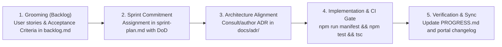

# SDLC Governance & Project Delivery Framework

> **Repository:** `react-interview-prep`  
> **Subsystem:** Software Development Life Cycle (SDLC) & Agile Execution  
> **Architecture Decision Record:** [`ADR-004: Consolidated Docs & SDLC Architecture`](../adr/ADR-004-consolidated-docs-sdlc-architecture.md)

---

## 1. Directory Structure

```text
docs/sdlc/
├── README.md               # 📖 This governance framework index
├── sprint-plan.md          # 🎯 Multi-Sprint Roadmap & Multi-Agent Handover Board
├── backlog/
│   ├── backlog.md          # 📋 Groomed Product Backlog & Acceptance Criteria
│   └── *.png               # User feedback screenshots & visual evidence
└── portal-sdlc.md          # ⚙️ Web Application Feature Matrix & CI Gates
```

---

## 2. Core Delivery Documents

| Document | Purpose | Audience |
| :--- | :--- | :--- |
| [**Sprint Plan (`sprint-plan.md`)**](./sprint-plan.md) | Active sprint execution board, multi-agent handover protocols, sprint goals, deliverables, and DoD. | Multi-Agent Pairs, Developers |
| [**Product Backlog (`backlog/backlog.md`)**](./backlog/backlog.md) | Groomed user stories, defect reports, root-cause analyses, acceptance criteria, and curriculum publication backlogs. | Product Owner, Developers |
| [**Portal SDLC (`portal-sdlc.md`)**](./portal-sdlc.md) | Feature inventory matrix for `apps/portal`, automated CI/CD quality gates, regression history, and release changelog. | Portal Developers, Architects |

---

## 3. High-Level Delivery Workflow (SDLC Gates)

Every feature, curriculum publication, or UI refactor progresses through 5 strict gates:



---

## 4. Key Cross-References
- 🏛️ **Architecture Decision Records:** [`docs/adr/`](../adr/README.md)
- 📊 **Curriculum Learning Tracker (Root):** [`PROGRESS.md`](../../PROGRESS.md)
- 📚 **Handbook Study Material (Root):** [`notes/`](../../notes)
- ⚛️ **Living Portal App (Root):** [`apps/portal/`](../../apps/portal)
- 🌐 **Live Deployed Web Application:** **[https://adarshsince90.github.io/react-interview-prep/](https://adarshsince90.github.io/react-interview-prep/)**
