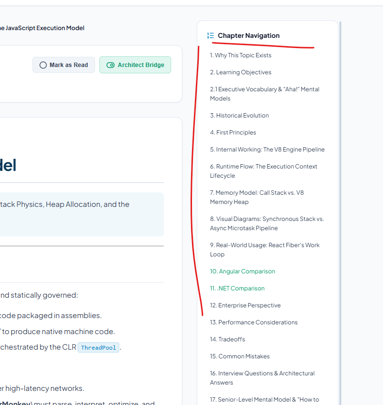
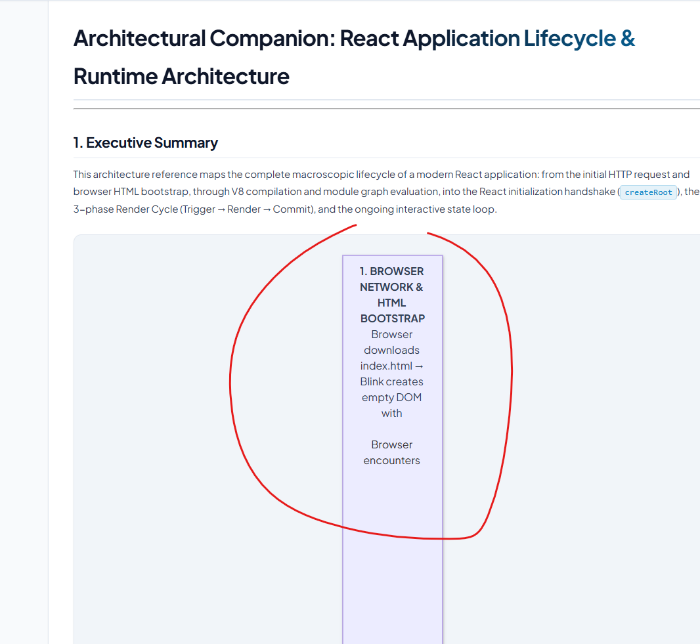
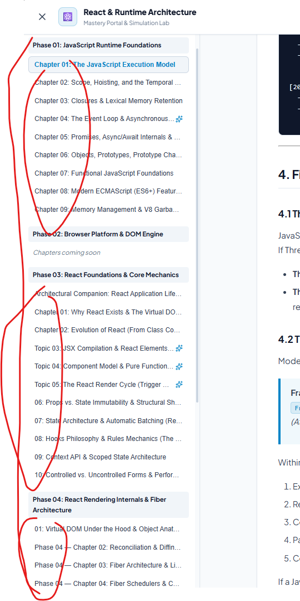
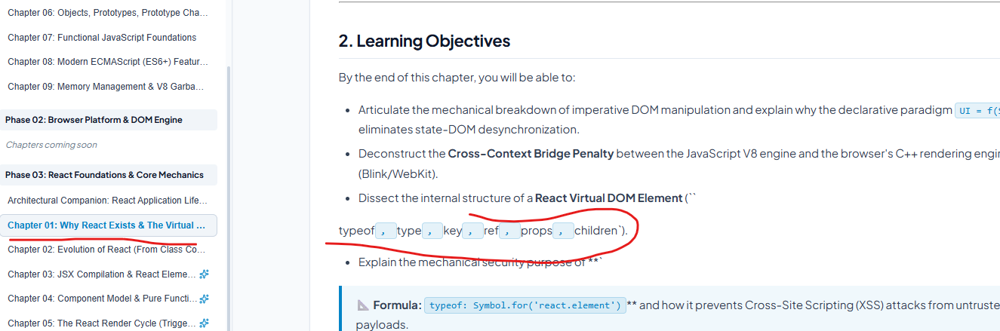
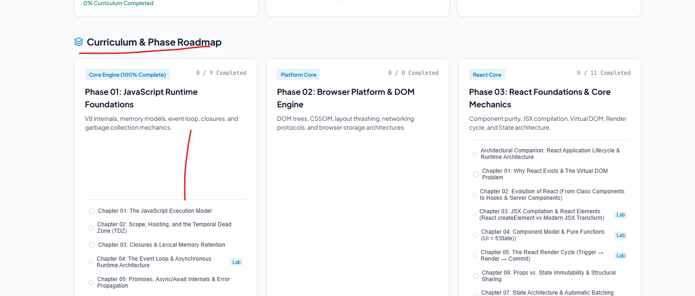
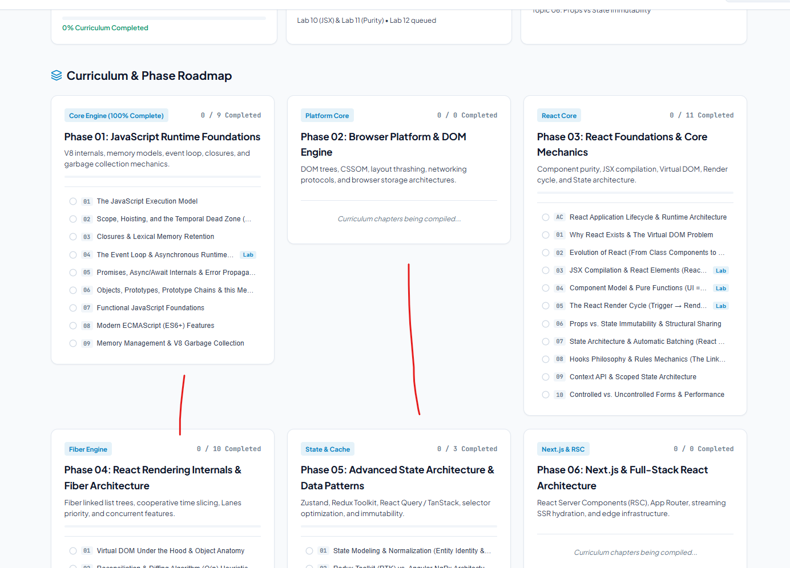
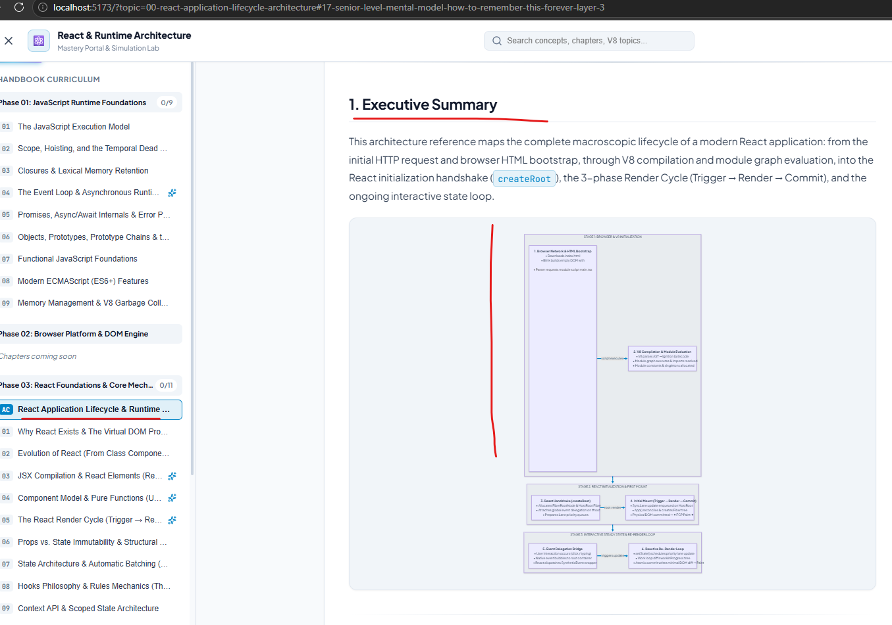
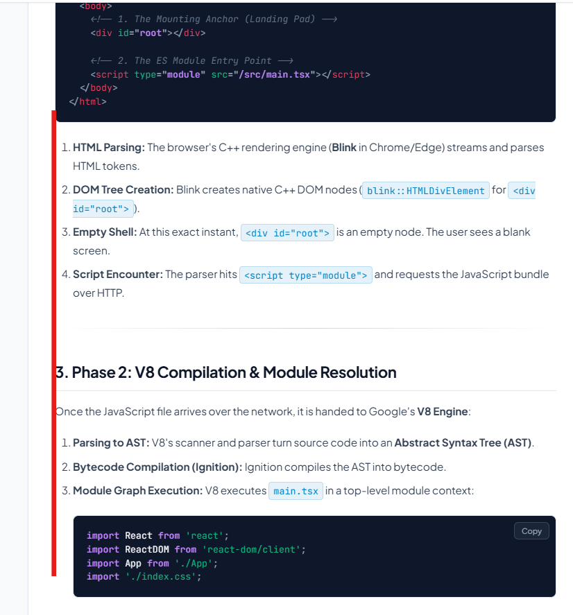

# Product Backlog: React & Runtime Architecture Learning Platform

> **Repository:** `react-interview-prep`  
> **Active Subsystems:** Study Notes (`notes/`), Interactive Portal (`apps/portal`), Mentorship Track  
> **Architecture Decision Records:** [`docs/adr/`](../../adr/README.md)  
> **Sprint Execution Plan:** [`docs/sdlc/sprint-plan.md`](../sprint-plan.md)  
> **Curriculum Progress:** [`PROGRESS.md`](../../../PROGRESS.md)

---

## 1. Active Sprint Backlog (Sprint 3: Portal UI/UX Modernization & Critical Fixes)

### Item UI-01: Right Panel Table of Contents Navigation & Sticky ScrollSpy

- **User Problem:**
  - The right panel navigation is not working when clicking on section headings.
  - The right panel should stay fixed/sticky in the viewport and not scroll out of view with the page, so the reader can easily navigate across different sections at any time.
- **Root Cause:**
  1. Build-time heading slugification in `scripts/generate-manifest.mjs` differed from runtime slugification in `marked.use({ renderer: { heading } })` in `TopicReader.tsx`, causing `document.getElementById(anchor)` lookups to fail on headings with numbers or punctuation.
  2. Sticky CSS positioning on the right container was compromised by viewport overflow constraints and lacked independent scrolling (`max-height: calc(100vh - 100px); overflow-y: auto`).
- **Acceptance Criteria:**
  - [x] Clicking any heading in the right panel smoothly scrolls the document to that section with an 80px offset for the fixed navbar.
  - [x] Right sidebar remains sticky in the viewport as the main content is scrolled.
  - [x] If the TOC list exceeds viewport height, the TOC container scrolls independently.
  - [x] Active section is highlighted in real-time as the user scrolls (ScrollSpy).

---

### Item UI-02: Responsive Diagram Sizing & Aspect-Ratio Clamping

- **User Problem:**
  - The diagrams (Mermaid boxes and runtime schematics) are vertically stretched, causing an excessively long page scroll and preventing a single-screen view of the diagram.
- **Root Cause:**
  - Rendered Mermaid SVG elements inside flex/grid containers default to `align-items: stretch` without a max-height bounding box.
- **Acceptance Criteria:**
  - [x] Mermaid diagrams rendered with `.mermaid-wrapper` with `max-height: 520px; width: 100%; object-fit: contain`.
  - [x] SVG aspect-ratios preserved across both light and dark themes.
  - [x] Code block ASCII diagrams rendered with uniform monospace font sizing (`0.85rem`) and fixed line-height to eliminate vertical distortion.

---

### Item UI-03: Sidebar Title Consistency & Badge Numbering

- **User Problem:**
  - In the left sidebar panel, titles are inconsistent: some show `Phase-Chapter`, others show pure numerical digits, and the last section shows `Phase - XX`.
- **Root Cause:**
  - Sidebar title parsing regex in `App.tsx` only handled one specific naming pattern (`^Chapter (\d+):`). Notes authored with different markdown titles fell back to raw file strings or bullets.
- **Acceptance Criteria:**
  - [x] Uniform badge format across all phases: `[01]`, `[02]`, `[AC]` (Architectural Companion).
  - [x] Stripped redundant `Phase XX - Chapter YY:` prefixes from display titles in the sidebar.
  - [x] Sidebar maintains clean progress counters (`X / Y` completed).

---

### Item UI-04: Typographic Polish & Constrained Prose Reading Experience
- **User Request:**
  - Spacing improvements in guide walkthrough (currently feels congested).
  - Modern fonts.
  - Improve the guide reading experience by fitting the reading view in a better way (currently rendered across excessive horizontal width).
- **Architecture Reference:** [`docs/adr/ADR-002`](../../adr/ADR-002-portal-ux-typographic-reading-system.md)
- **Acceptance Criteria:**
  - [x] Constrain prose reading container to `max-width: 780px; margin: 0 auto;` (optimal 65–75 characters per line).
  - [x] Modern typography stack: Plus Jakarta Sans for UI/body, JetBrains Mono for code.
  - [x] Standardize line-height to `1.7` with balanced paragraph, list, and heading spacing.
  - [x] Clean glassmorphic callouts for alerts (NOTE, TIP, IMPORTANT, WARNING).

---

### Item UI-05: Modern UI/UX Polish, Micro-Animations & Interactivity
- **User Request:**
  - Modernize overall UI/UX.
  - Add subtle animations and hover effects to make learning engaging and fun.
- **Acceptance Criteria:**
  - [x] Smooth chapter fade-and-slide entrance transitions.
  - [x] Card hover lift and subtle border glow effects on Dashboard roadmap cards.
  - [x] "Back to Top" floating quick action button in reading view.
  - [x] "Architect Bridge" toggle with vibrant emerald/indigo accent indicators for Sections 10 and 11.

---

### Item UI-06: URL Routing Synchronization on Dashboard Navigation & Refresh
- **User Problem:**
  - When moving to Dashboard from any guide page (e.g., `http://localhost:5173/?topic=00-react-application-lifecycle-architecture#17-senior-level-mental-model-how-to-remember-this-forever-layer-3`), the browser URL remained pinned with the active topic query parameter and section hash.
  - Hitting browser refresh (F5) while viewing the Dashboard re-parsed the stale query parameters, erroneously kicking the reader back into the guide page instead of staying on Dashboard.
- **Root Cause:**
  1. Top navbar Brand logo click (`div`) and Dashboard switcher button (`button`) invoked `setActiveView('dashboard')` directly without pushing history state or clearing `window.location.search` and `window.location.hash`.
  2. `handleNavigateHome()` previously called `searchParams.delete('topic')` on the current URL, which preserved active section hashes (`#17-...`).
  3. Lack of unified bidirectional routing between `view` parameters (`dashboard`, `reader`, `labs`), causing page refresh to lose state context.
- **Acceptance Criteria:**
  - [x] Clicking Brand logo, Dashboard tab, or breadcrumb "Home" replaces the browser URL with a clean base path (clearing query parameters and section hashes).
  - [x] Refreshing the browser while on Dashboard preserves the Dashboard view.
  - [x] Switching between Handbook, Dashboard, and Labs synchronizes the browser address bar bi-directionally.
  - [x] Browser Back and Forward buttons (`popstate`) accurately transition between topics and dashboard.

---

## 2. Curriculum Publication Backlog (Epics 4, 5, 6)

### Epic 4: Phase 05 Completion (Advanced State & Data Architecture)
*Location:* `notes/phase-05-advanced-state-architecture/` | *Format:* 20-Section Standard
- [x] Topic 01: State Modeling & Normalization (`01-state-modeling-normalization.md`)
- [x] Topic 02: Redux Toolkit vs. Angular NgRx (`02-redux-toolkit-rtk-vs-ngrx.md`)
- [x] Topic 03: Zustand & Atomic State Management (`03-zustand-atomic-state.md`)
- [x] Topic 04: Server State & TanStack Query (React Query) Architecture (`04-tanstack-query-server-state.md`)
- [x] Topic 05: Cache Invalidation, Garbage Collection & Optimistic UI Updates (`05-cache-invalidation-optimistic-ui.md`)
- [x] Topic 06: Reselect, Memoization & Selector Performance (`06-reselect-memoization-performance.md`)
- [x] Topic 07: URL State Management & Deep Linking Patterns (`07-url-state-management.md`)
- [x] Topic 08: Real-Time State (WebSockets, SSE) & React Synchronization (`08-realtime-websockets-sync.md`)
- [x] Topic 09: State Machines with XState in Complex UI Workflows (`09-state-machines-xstate.md`)
- [x] Topic 10: Enterprise Offline-First & Persistent State Strategies (`10-offline-first-persistence.md`)

---

### Epic 5: Phase 06 Full Publication (Next.js & Full-Stack React Architecture)
*Location:* `notes/phase-06-nextjs-fullstack-react/` | *Format:* 20-Section Standard
- [ ] Topic 01: Next.js App Router Architecture & Server-First Mental Model
- [ ] Topic 02: React Server Components (RSC) Wire Format & Payload Streaming
- [ ] Topic 03: Server Actions & Form Mutations
- [ ] Topic 04: Static Site Generation (SSG) vs Incremental Static Regeneration (ISR)
- [ ] Topic 05: Middleware & Edge Runtime Mechanics
- [ ] Topic 06: Authentication & Session Management in Full-Stack Next.js
- [ ] Topic 07: Route Handlers & REST/GraphQL API Design
- [ ] Topic 08: Caching Architecture (Request Memoization, Data Cache, Full Route Cache)
- [ ] Topic 09: Dynamic Imports, Bundling & Code Splitting Optimization
- [ ] Topic 10: Enterprise Next.js Deployment & Observability (Docker, Vercel, Azure)

---

### Epic 6: Phase 07 Capstone Synthesis (Angular ➔ React Enterprise Playbook)
*Location:* `notes/phase-07-angular-to-react-enterprise-synthesis/` | *Format:* 20-Section Standard
- [x] Topic 00: Angular vs. React Mental Model (`00-angular-vs-react-mental-model.md`)
- [ ] Topic 01: Angular to React Architectural Mapping Guide
- [ ] Topic 02: Change Detection (Zone.js/Signals) vs React Reconciliation (Fiber)
- [ ] Topic 03: RxJS Reactive Streams vs React Hooks & State Primitives
- [ ] Topic 04: Angular Hierarchical Dependency Injection vs React Composition & Context
- [ ] Topic 05: NgRx Store Architecture vs Redux Toolkit & Zustand
- [ ] Topic 06: Angular Route Guards & Interceptors vs React Routers & Middleware
- [ ] Topic 07: Angular Signals (Fine-Grained) vs React State & React Compiler
- [ ] Topic 08: Enterprise Clean Architecture: Scalable Angular vs Scalable React Applications

---

## 3. Completed Backlog Items

- **Issue**: The symbol at right in Chapter 01 (Learning Objectives) is not properly understood:
  `typeof, type, key, ref, props, children`).`
  Rendered with a stray math formula box below it.
- **Root Cause**:
  1. The symbol is React's internal security property: `$$typeof: Symbol.for('react.element')` (used to prevent client-side Cross-Site Scripting (XSS) via un-sanitized JSON payloads from being treated as valid React elements).
  2. In `TopicReader.tsx`, the LaTeX formula cleaner `cleanMarkdownFormatting` used an over-eager regex `/\$\$\s*([\s\S]+?)\s*\$\$/g`. When line 37 contained `$$typeof` and line 38 contained `$$typeof`, the regex greedily matched between the two `$$` instances as if they were LaTeX display math markers, stripping backticks and rendering the text in an unintended KaTeX formula box.
- **Resolution**:
  Replaced greedy regex matching in `TopicReader.tsx` with strict negative lookaround boundaries `(?<![`\w])\$\$...\$\$(?![`\w])` and a validation check requiring LaTeX escape commands (`\`) before treating any block as math syntax. This permanently shields symbols like `$$typeof`, `$$id`, `$$async`, and `$${...}` across all 34 chapters.

---

- **Issue**: Excessive vertical gaps in Phase 01 and Phase 02 roadmap cards on Dashboard.
- **Root Cause**:
  1. In `Dashboard.tsx`, the roadmap card grid used default CSS Grid stretch alignment (`align-items: stretch`). Because Phase 03 contains 11 topics while Phase 01 contains 4 topics, Phase 01's card was stretched to match the height of Phase 03.
  2. Inside each card, the root container used `display: flex; flex-direction: column; justify-content: space-between;`. With stretched card heights, this pushed the phase description and topic list ~300px apart to opposite edges.
- **Resolution**:
  1. Set `alignItems: 'start'` on the phase roadmap grid container so cards scale naturally according to their topic content height.
  2. Replaced `justifyContent: 'space-between'` with uniform content `gap: '1rem'`.
  3. Added an inline phase progress bar under the description and styled topic rows with matching `[01]`, `[02]`, `[AC]` number pills for consistent visual polish.

---

- **Issue**: Roadmap phase cards had uneven heights across rows when using `align-items: start`, creating large empty gaps between cards on row 1 and row 2.
- **Root Cause**:
  Cards with few or zero authored topics (such as Phase 02) stopped early, while cards with many topics (Phase 03) extended deep. In CSS Grid, this resulted in an irregular staggered grid layout with uneven vertical voids between cards.
- **Resolution**:
  1. Enforced a uniform card height (`height: 420px`) across all `.roadmap-phase-card` components on the Dashboard.
  2. Structured cards as flex columns where header content has `flex-shrink: 0` and the topic links container uses `flex: 1; min-height: 0; overflow-y: auto;`.
  3. Cards with extensive topics (e.g. Phase 03 with 11 topics) now scroll smoothly with a custom-styled scrollbar, while cards with 0 topics vertically center an authoring status placeholder.
  4. All cards across rows and columns now maintain a pixel-perfect, cohesive grid alignment.

---

- **Issue**: In `00-react-application-lifecycle-architecture.md`, the box `1. Browser Network & HTML Bootstrap` stretched excessively tall (~1000px high with massive blank vertical space), distorting the SVG aspect ratio and shrinking the entire Mermaid diagram into an unreadable, narrow vertical column.
- **Root Cause**:
  1. The Mermaid label contained `&lt;div id='root'&gt;`, which Mermaid decoded into `
` when injecting HTML into the SVG `<foreignObject>`.
  2. In `index.css`, the global React container selector `#root { min-height: 100vh; display: flex; flex-direction: column; }` matched this injected element, forcing that single diagram step box to expand to `100vh` (~1000px).
  3. Dagre layout engine stretched `Stage 1` to accommodate the 1000px element, creating an extreme tall-and-narrow aspect ratio that forced the responsive SVG wrapper to shrink horizontally.
- **Resolution**:
  1. Scoped the main application container selector in `apps/portal/src/index.css` to `body > #root`, completely insulating inner SVG elements and markdown content from inheriting global layout heights.
  2. Added defensive resets in `apps/portal/src/index.css` (`.mermaid .node foreignObject > div { min-height: unset !important; }` and `.mermaid [id='root'] { min-height: unset !important; }`).
  3. Updated `00-react-application-lifecycle-architecture.md` to use clean plaintext notation `div#root` instead of HTML tags in the Mermaid diagram.
  4. Resynced notes via `npm run manifest`. Step 1 and Step 2 now share a balanced ~120px height, allowing the diagram to span horizontally across full width with crystal-clear readability.

---

- **Issue**: In Section 3 ("Phase 2: V8 Compilation & Module Resolution") of `00-react-application-lifecycle-architecture.md`, the `main.tsx` code snippet box was indented inwards to the right, misaligned with the section heading, intro prose, and other code boxes.
- **Root Cause**:
  The code block was indented under list item `3. Module Graph Execution:`, causing marked to nest `<pre>` inside `<ol><li>`. This added list indentation (`padding-left: 1.75rem`) and list item marker margins, breaking the clean left vertical baseline of the document.
- **Resolution**:
  1. Realigned Section 3 in `00-react-application-lifecycle-architecture.md` to follow the consistent architectural layout of Section 2 and Section 4: placing the code block at the section level (100% full width, flush left) followed by the step-by-step breakdown.
  2. Refined standard list padding in `apps/portal/src/index.css` to `1.45rem` for balanced typographic hierarchy.
  3. Added defensive styling for code blocks nested inside list items (`.markdown-body li > .code-block-wrapper, .markdown-body li > pre { margin: 0.85rem 0; }`).