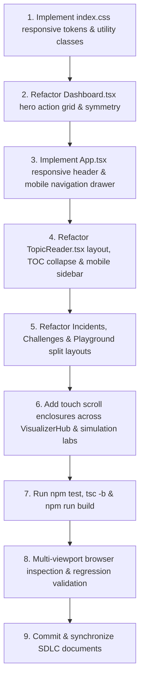

# Sprint 21 Implementation Plan: Full-Spectrum Responsive Design, UI/UX Polish & Cross-Platform Alignment

> **Sprint:** 21 (`v0.20.0`)  
> **Feature Branch:** `feature/portal-responsive-alignment`  
> **Target Subsystem:** `apps/portal` (Vite 8 + React 19 + TypeScript)  
> **SDLC Epic Reference:** `Epic 21` in [`docs/sdlc/backlog/backlog.md`](../backlog/backlog.md)  
> **Backlog Intake:** `UNPLANNED-RESPONSIVE-ALIGNMENT` in [`docs/sdlc/backlog/unplanned-backlog.md`](../backlog/unplanned-backlog.md)  
> **Author:** Staff Frontend Architect & Mentor Pair  
> **Status:** Pending Review before One-Go Execution

---

## 1. Executive Summary & Problem Diagnosis

During visual inspections and testing of `apps/portal`, two primary categories of UX friction were identified:
1. **Asymmetrical Layouts & Alignment Defects (e.g. Hero Action Button Strip):**
   - In [`Dashboard.tsx`](../../apps/portal/src/features/dashboard/Dashboard.tsx), an arbitrary `maxWidth: '780px'` constraint forces the 4th action button (`Incident War Room`) to wrap alone onto a second line, leaving an awkward orphan button.
   - Text boxes, metric cards, and badge rows exhibit subtle padding misalignments on different display scalings.
2. **Desktop-Centric Viewport Rigidity (Mobile & Small Display Friction):**
   - The top navigation bar in [`App.tsx`](../../apps/portal/src/App.tsx) hardcodes 7 module tabs and a 320px search input inline (~1280px min width), causing horizontal page overflow on small laptops and phones.
   - The reader layout in [`TopicReader.tsx`](../../apps/portal/src/features/topic-reader/TopicReader.tsx) locks the viewport into `minmax(0, 820px) 290px`, competing with the 320px left curriculum sidebar.
   - Interactive arenas ([`IncidentsArena.tsx`](../../apps/portal/src/features/incidents/IncidentsArena.tsx), [`ChallengesArena.tsx`](../../apps/portal/src/features/challenges/ChallengesArena.tsx)) hardcode fixed `360px 1fr` and `320px 1fr` columns that crush content on screens `< 900px`.
   - Simulation laboratories contain high-density diagrams, AST trees, and flame charts that must not be squished or degraded to fit mobile screens.

---

## 2. Architectural Principles & Non-Negotiable Constraints

1. **Zero Regression Rule:**
   - Every existing interactive feature (Event loop simulation, Fiber work loop step debugger, TanStack cache visualizer, Incident communications tabs, 45-min interview timer, full-text search) must continue functioning with 100% fidelity.
   - Zero changes to markdown content in `notes/` or curriculum manifest structure.
2. **Pure CSS Media Queries Over JS Window Resize Listeners:**
   - Responsive adaptations (stacking, collapsing, wrapping) must execute via CSS media queries in [`index.css`](../../apps/portal/src/index.css) to eliminate layout thrashing and prevent unnecessary React component re-renders.
   - React state is strictly confined to user interaction triggers (e.g., opening/closing the mobile navigation drawer).
3. **Adaptive Dual-Strategy for Small Viewports:**
   - **Content & Shell Views (Dashboard, Reader, Quizzes, Flashcards):** 100% fluid, single-column stacks with off-canvas drawers and touch-optimized typography.
   - **Dense Interactive Workbenches (Fiber tree, Retainer graph, Code Diff, Flamechart):** Preserve complete desktop density and tooling capabilities. Wrap them inside hardware-accelerated touch scroll containers (`overflow-x: auto; -webkit-overflow-scrolling: touch;`) with visual scrollbar indicators and mobile segmented pane switches (`[ Problem / Clues ]` ↔ `[ War Room Console ]`).
4. **Performance Safeguards:**
   - No heavy third-party CSS frameworks (no Tailwind runtime bloat).
   - Minimal DOM footprint; zero layout shift (CLS < 0.05).
   - Bundle size verified before and after build (`npm run build`).

---

## 3. Detailed Component-by-Component Work Breakdown

### Task 1: Responsive CSS Foundation & Design System (`index.css`)
- **File:** `apps/portal/src/index.css`
- **Changes:**
  - Define standard responsive variables:
    ```css
    :root {
      --bp-mobile: 640px;
      --bp-tablet: 960px;
      --bp-desktop: 1200px;
    }
    ```
  - Create touch-friendly scroll enclosure utility:
    ```css
    .scroll-touch-container {
      overflow-x: auto;
      overflow-y: hidden;
      -webkit-overflow-scrolling: touch;
      scrollbar-width: thin;
      max-width: 100%;
    }
    ```
  - Add responsive header and sidebar utility classes:
    - `.portal-nav-desktop` (visible on `>= 960px`, hidden below).
    - `.portal-nav-mobile` (hidden on `>= 960px`, visible below).
    - `.portal-drawer-overlay` (backdrop blur + smooth slide-in animation).
    - `.responsive-stack-grid` (auto-fit or 1-column stack below 900px).
    - `.prose-code-block` (pre/code horizontal overflow containment).

### Task 2: Dashboard Hero & Action Grid Symmetry (`Dashboard.tsx`)
- **File:** `apps/portal/src/features/dashboard/Dashboard.tsx`
- **Changes:**
  - Remove hardcoded `maxWidth: '780px'` from the hero copy container.
  - Convert the 4 action buttons into an aesthetic, balanced action grid:
    ```tsx
    <div className="dashboard-hero-action-grid">
      {/* Button 1: Launch JSX Simulator */}
      {/* Button 2: Test Component Purity */}
      {/* Button 3: Staff Mock Interviews */}
      {/* Button 4: Incident War Room */}
    </div>
    ```
  - CSS styling:
    - Wide Desktop (`>= 1200px`): Symmetrical 4-button horizontal row with flexible equal sizing.
    - Medium / Tablet (`640px - 1199px`): Balanced 2x2 grid with identical heights, icons, and hover glows. Zero orphan buttons!
    - Mobile (`< 640px`): Single-column full-width touch cards (`min-height: 48px`).
  - Audit and refine metric cards (`Handbook Study Progress`, `Next Recommended Chapter`, `Recent Study Queue`, `Interactive Labs Active`) to auto-fit smoothly down to 320px width without horizontal blowout.

### Task 3: Top Navigation Bar & Mobile Drawer (`App.tsx`)
- **File:** `apps/portal/src/App.tsx`
- **Changes:**
  - Introduce `mobileNavOpen` state (`useState<boolean>(false)`).
  - Desktop Header (`>= 960px`):
    - Display brand logo, 320px search bar with `Ctrl+K` badge, all 7 navigation tabs (`Dashboard`, `Handbook`, `Labs`, `Challenges`, `Mock Interviews`, `War Room`, `Flashcards`, `Quizzes`), and theme toggle.
  - Mobile Header (`< 960px`):
    - Compact logo and title.
    - Compact search icon button (triggers `setIsSearchModalOpen(true)`).
    - Theme toggle button (Sun/Moon).
    - Hamburger button (`Menu` / `X` icon) toggling `mobileNavOpen`.
  - Mobile Slide-Over Drawer:
    - Fixed position on right/left with backdrop overlay (`rgba(0,0,0,0.55)` with `backdrop-filter: blur(4px)`).
    - Vertical list of all 7 modules with badges, icons, and active indicators.
    - Clicking any item navigates to the view and closes the drawer immediately.
    - Accessible Esc key and backdrop click handlers.

### Task 4: TopicReader Fluid Layout & Off-Canvas Navigation (`TopicReader.tsx`, `App.tsx`)
- **Files:** `apps/portal/src/features/topic-reader/TopicReader.tsx`, `apps/portal/src/App.tsx`
- **Changes in `App.tsx` (Curriculum Sidebar):**
  - On screens `< 860px`, the 320px curriculum sidebar converts from `position: sticky` inline column to an off-canvas drawer with smooth transition.
  - Clicking any chapter title closes the mobile sidebar and scrolls the chapter content to top.
- **Changes in `TopicReader.tsx`:**
  - Replace inline `gridTemplateColumns: 'minmax(0, 820px) 290px'` with `.topic-reader-grid`.
  - On screens `< 1120px`:
    - Reading column expands to `100%` width.
    - Right-hand Table of Contents collapses into a sticky/floating "Chapter Navigation" pill or expandable header accordion, preserving section anchor jumping.
  - Markdown Code & Diagram Containment:
    - Ensure all `<pre>`, `<table>`, and `.mermaid-container` blocks have `overflow-x: auto; max-width: 100%;` with rounded scrollbars so wide code snippets never cause document horizontal overflow.

### Task 5: Interactive Arenas Adaptive Stacking (`IncidentsArena.tsx`, `ChallengesArena.tsx`, `CodePlayground.tsx`)
- **Files:**
  - `apps/portal/src/features/incidents/IncidentsArena.tsx`
  - `apps/portal/src/features/challenges/ChallengesArena.tsx`
  - `apps/portal/src/features/playground/CodePlayground.tsx`
- **Changes:**
  - In `IncidentsArena.tsx`:
    - Replace fixed `gridTemplateColumns: '360px 1fr'` with responsive class `.arena-split-layout`.
    - On screens `< 900px`, provide a segmented view control:
      - `[ Incident Scenarios (4) ]` ↔ `[ Active War Room Arena ]`.
      - Selecting a scenario on mobile automatically switches the active view to the War Room tab.
    - Wrap the Forensic Diagnostics Sandbox and Telemetry bar charts in `.scroll-touch-container`.
  - In `ChallengesArena.tsx`:
    - On screens `< 900px`, stack the 320px challenge selector vertically above the challenge workbench or provide a mobile dropdown selector.
  - In `CodePlayground.tsx`:
    - On screens `< 860px`, stack the template sidebar vertically above the Monaco/code editor.

### Task 6: Simulation Labs & Visualizer Touch Enclosures (`VisualizerHub.tsx` & Labs)
- **Files:**
  - `apps/portal/src/features/visualizers/VisualizerHub.tsx`
  - Specific simulation components (`FiberReconciliationLab.tsx`, `RscFlightLab.tsx`, `CanvasDesignLab.tsx`, `MemoryRetainerLab.tsx`, `VirtualizationLab.tsx`, `TestingLab.tsx`)
- **Changes:**
  - In `VisualizerHub.tsx`:
    - On screens `< 960px`, stack the 320px navigation panel above the active lab or provide a horizontal scrolling chip row / mobile dropdown selector (`Choose Simulation: [V8 Event Loop ▾]`).
    - Gives full screen width to the active lab canvas.
  - In individual labs:
    - Wrap all wide diagrams, AST inspection tables, CRDT node canvases, and Fiber tree graphs in `.scroll-touch-container`.
    - Convert rigid multi-column stat headers (`repeat(4, 1fr)`) to fluid auto-fit grids (`repeat(auto-fit, minmax(180px, 1fr))`).

### Task 7: Automated Quality Gates & Multi-Viewport Verification
- **Verification Commands:**
  1. `npm test`: Validates manifest integrity and simulation lab files (100% pass).
  2. `npx tsc -b`: Validates TypeScript strict mode across all edited files.
  3. `npm run build`: Validates production bundle generation.
- **Viewport Testing Matrix:**
  - Mobile Small: 375px x 667px (iPhone SE).
  - Mobile Medium: 390px x 844px (iPhone 14/15).
  - Tablet: 768px x 1024px (iPad Mini/Air).
  - Laptop: 1280px x 800px / 1366px x 768px.
  - Desktop: 1920px x 1080px.

---

## 4. Execution Sequence (One-Go Automated Workflow)

Once this plan is reviewed and approved by the user, the execution will proceed autonomously in sequence:



---

## 5. Definition of Done (DoD)

- [ ] Hero action buttons in `Dashboard.tsx` are arranged symmetrically (no orphan button wrapping).
- [ ] Top navigation bar adapts seamlessly to mobile (<960px) via hamburger menu and slide-out drawer.
- [ ] Global search input collapses to a search icon on mobile, opening `GlobalSearchModal`.
- [ ] TopicReader functions fluidly on mobile/tablet with an off-canvas drawer and collapsible TOC.
- [ ] Interactive arenas (`Incidents`, `Challenges`, `Playground`) stack cleanly without horizontal clipping.
- [ ] Complex simulation labs maintain 100% desktop capabilities with smooth touch scroll containers.
- [ ] Zero TypeScript errors (`tsc -b`), zero build warnings, and 100% passing test assertions (`npm test`).
- [ ] Verified live in dev server (`http://localhost:5173/`).
