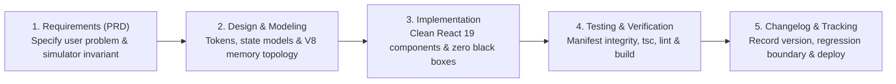

# Interactive Learning Portal: Software Development Life Cycle (SDLC) & Feature Tracker

> **Repository Subsystem:** `apps/portal` (Companion Living Architecture & Simulation Portal)  
> **Tech Stack:** React 19 + TypeScript 5.8 + Vite 8 + Custom Vanilla CSS Design System  
> **Authoritative Specification Document:** Governs requirements, architecture, verification gates, and release changelogs.

---

## 1. System Philosophy & Quality Gateways

The `apps/portal` web application is an **enterprise-grade architectural showcase**. It is built with the same discipline, type-safety, and performance standards expected of Senior, Lead, and Staff Frontend Architects.

### The 5 Standard SDLC Stages
Every new feature, simulator lab, or architectural refactor in `apps/portal` strictly passes through 5 distinct gates:



---

## 2. Verification & Testing Standards (The CI/CD Gate)

Before any new feature is considered complete or committed, the following automated pipeline must pass with **zero errors and zero warnings**:

| Command | Purpose | Verification Gate |
| :--- | :--- | :--- |
| `npm run manifest` | Auto-indexes `notes/` into `src/assets/manifest.json` and syncs to `public/notes`. | Validates all 7 phases and chapter titles. |
| `npm test` (`npm run test:integrity`) | Executes `scripts/test-manifest-integrity.mjs`. | Verifies 100% of manifest files physically exist on disk and all mapped labs exist. |
| `npx tsc --noEmit` | Strict TypeScript compiler validation. | Catches type mismatches and interface breakages. |
| `npm run lint` | Fast static analysis via `oxlint`. | Prevents code smell and syntax antipatterns. |
| `npm run build` | Full production bundle compilation. | Guarantees clean tree-shaking, Rollup bundling, and asset minification. |

---

## 3. Web App Feature Inventory & Status Matrix

### Category A: Core Reader & App Shell
| Feature ID | Feature Name | Description | Status | Added In |
| :--- | :--- | :--- | :--- | :--- |
| **FEAT-CORE-01** | **Vite + React 19 Scaffolding** | Base project, strict TypeScript configuration, asset paths. | [x] **Complete** | v0.1.0 |
| **FEAT-CORE-02** | **Vanilla CSS Token System** | High-contrast, sleek design system with CSS custom properties. | [x] **Complete** | v0.1.0 |
| **FEAT-CORE-03** | **Light & Dark Theme Switcher** | Modern light theme tokens as default with seamless dark mode switch. | [x] **Complete** | v0.2.0 |
| **FEAT-CORE-04** | **Browser Progress Persistence** | LocalStorage persistence for completed topics and reader scratchpads. | [x] **Complete** | v0.2.0 |
| **FEAT-CORE-05** | **SPA Cross-Link Interceptor** | Intercepts markdown `[link](file://...)` links to keep navigation inside SPA. | [x] **Complete** | v0.2.0 |
| **FEAT-CORE-06** | **Mermaid Vector SVG Rendering** | Compiles ````mermaid ```` blocks into dynamic, responsive SVG diagrams. | [x] **Complete** | v0.2.0 |
| **FEAT-CORE-07** | **Scratchpad & Copy for Mentor** | In-reader scratchpad with one-click Markdown clipboard formatting. | [x] **Complete** | v0.2.0 |
| **FEAT-CORE-08** | **Automated Integrity Test Suite** | `scripts/test-manifest-integrity.mjs` verifying note and lab links. | [x] **Complete** | v0.2.1 |

---

### Category B: Interactive Simulation Labs (Living Arena)
| Lab ID | Lab Name | Topic Association | Interactive Features | Status |
| :--- | :--- | :--- | :--- | :--- |
| **LAB-10** | **JSX Compiler & `$$typeof` Inspector** | Phase 03 Topic 03 (`03-jsx-compilation`) | Live JSX-to-`_jsx` AST desugaring, XSS JSON injection test, falsy `0` bug sandbox. | [x] **Complete** |
| **LAB-11** | **Component Purity & StrictMode** | Phase 03 Topic 04 (`04-component-model-pure-functions`) | In-place mutation (`.sort`) vs pure ES2023 (`.toSorted`), StrictMode double-rendering stress-test. | [x] **Complete** |
| **LAB-12** | **Render Cycle Stepper** | Phase 03 Topic 05 (`05-render-cycle`) | 5-stage Trigger → Render → Commit → Paint stepper, Double Buffering inspector, microsecond telemetry. | [x] **Complete** |
| **LAB-09** | **Enterprise Architecture & Strangler Fig Lab** | Phase 09 Topics 01-08 (`topic-09-architecture`) | FSD Layer Dependency Matrix, Module Federation Singleton Resolver, Strangler Fig Route Delegator. | [x] **Complete** |
| **LAB-04** | **4-Lane Event Loop Simulator** | Phase 01 Topic 04 (`04-event-loop`) | Call Stack, Microtasks, 16.6ms Render Gate, Macrotasks, 60 FPS meter, and INP regression simulator. | [x] **Complete** |
| **LAB-13** | **Reconciliation & Diffing Visualizer** | Phase 04 Topic 02 (`02-reconciliation-diffing-algorithm`) | Step-by-step list reordering, `lastPlacedIndex` watermark move tracker, index-as-key state bleed demo. | [x] **Complete** |
| **LAB-14** | **Fiber Linked-List Work Loop** | Phase 04 Topic 03 (`03-fiber-architecture`) | Interactive `child`, `sibling`, `return` linked-list tree walker with step pause/resume. | [x] **Complete** |
| **LAB-19** | **RSC Flight Wire Format Parser** | Phase 04 Topic 09 (`09-rsc-internals`) | Live parser of `M`, `J`, `S` Flight chunks with client reference component boundary inspector. | [x] **Complete** |
| **LAB-15** | **31-Bit Priority Lanes Inspector** | Phase 04 Topic 05 (`05-lanes-priority-mechanics`) | Bitwise operations (`lanes & -lanes`), 16 parallel transition lanes, starvation escalation. | 📋 *Backlog* |
| **LAB-21** | **State Normalization Visualizer** | Phase 05 Topic 01 (`01-state-modeling-normalization`) | Nested tree vs flat normalized `byId`/`allIds` tables with O(1) mutation comparison. | 📋 *Backlog* |

---

### Category C: Learning Optimization & Assessment
| Feature ID | Feature Name | Description | Status | Added In |
| :--- | :--- | :--- | :--- | :--- |
| **FEAT-LEARN-01** | **Flashcards Arena** | Interactive flashcards drilling sticky memory anchors ("Museum Rule", "Slide Projector", "Wax Signet"). | [x] **Complete** | v0.13.0 |
| **FEAT-LEARN-02** | **Architect Scenario Quizzes** | Multiple-choice and code puzzle interview drills with real-time Staff Architect critique. | [x] **Complete** | v0.13.0 |
| **FEAT-LEARN-03** | **Client-Side Full Text Search** | Fast instant global search modal (`Ctrl+K`) indexing 110 publication-grade chapters. | [x] **Complete** | v0.13.0 |
| **FEAT-LEARN-04** | **GitHub Pages Deployment** | Automated GitHub Actions CI workflow (`deploy.yml`) building and deploying to GitHub Pages. | [x] **Complete** | v0.14.0 |

---

### Category D: Navigation, Wayfinding & Hyperlinked Knowledge Graph
| Feature ID | Feature Name | Description | Status | Added In |
| :--- | :--- | :--- | :--- | :--- |
| **FEAT-NAV-01** | **Interactive Breadcrumb Trail** | Hierarchical wayfinding (`Dashboard > Phase XX > Chapter Title`) with click-to-navigate ancestor nodes. | [x] **Complete** | v0.3.0 |
| **FEAT-NAV-02** | **Topic Navigation History & "Go Back" Stack** | Stateful history stack recording in-app jumps with dedicated `← Back to [Previous Topic]` button and browser `pushState`/`popstate` sync. | [x] **Complete** | v0.3.0 |
| **FEAT-NAV-03** | **Sequential Chapter Walker** | Bottom-of-article dual action cards (`← Previous Topic: [Title]` and `Next Topic: [Title] →`) for uninterrupted sequential study across phases. | [x] **Complete** | v0.3.0 |
| **FEAT-NAV-04** | **Cross-Article Link Resolver & Anchor Jumps** | Intercepts markdown cross-topic links, resolves section anchors (`#heading`), and smooth-scrolls in SPA state without full reload. | [x] **Complete** | v0.3.0 |

---

### Category E: UI/UX Modernization & Typographic Reading System
| Feature ID | Feature Name | Description | Status | Target Version |
| :--- | :--- | :--- | :---: | :---: |
| **FEAT-UI-01** | **Sticky Table of Contents & Synchronized ScrollSpy** | Pinned viewport TOC with matching build/runtime slugifier and smooth-scrolling offset. | [x] **Complete** | v0.4.0 |
| **FEAT-UI-02** | **Diagram Bounding & Aspect-Ratio Preservation** | `.mermaid-wrapper` with `max-height: 520px` and responsive SVG viewBox clamping. | [x] **Complete** | v0.4.0 |
| **FEAT-UI-03** | **Constrained Typographic Prose (`max-width: 780px`)** | Distraction-free reading column (65–75 CPL) with enhanced line-height (`1.7`) and hierarchy. | [x] **Complete** | v0.4.0 |
| **FEAT-UI-04** | **Standardized Sidebar Badges & Title Normalization** | Uniform `[01]`, `[02]`, `[AC]` pills across all phases with stripped redundant prefixes. | [x] **Complete** | v0.4.0 |
| **FEAT-UI-05** | **Micro-Interactions & "Back to Top" Action** | Floating smooth scroll button, card hover lifts, and smooth chapter transition animations. | [x] **Complete** | v0.4.0 |

---

## 4. Versioned Release Changelog (Regression History)

### [v0.20.0] - 2026-10-08
- **Added:** Full-Spectrum Mobile & Cross-Platform Responsive Framework in `index.css`:
  - Defined responsive breakpoints (`--bp-mobile: 480px`, `--bp-tablet: 768px`, `--bp-desktop: 1024px`, `--bp-wide: 1280px`).
  - Implemented universal `.scroll-touch-container` with native momentum touch scrolling and custom low-friction scrollbars.
  - Implemented adaptive layout grids (`.dashboard-hero-action-grid`, `.topic-reader-main-grid`, `.responsive-diff-grid`, `.responsive-split-grid`, `.incidents-arena-grid`, `.challenges-arena-grid`, `.playground-arena-grid`, `.visualizer-hub-layout`).
- **Fixed:** Dashboard Hero Action Strip Symmetry (`UI-HERO-ALIGNMENT`): Removed restrictive `maxWidth: '780px'` container; converted action strip into an auto-fit 4-card grid on desktop, 2x2 symmetrical grid on tablet, and 1-column stack on mobile. Zero orphan buttons wrap alone.
- **Added:** Mobile Navigation Drawer & Compact Search Trigger (`FEAT-RESPONSIVE-SHELL`): Topbar automatically hides tab strip below 980px in favor of a slide-over mobile drawer with all 8 module routes and curriculum metrics footer. Added compact search button triggering `GlobalSearchModal`.
- **Added:** TopicReader Mobile Table of Contents & Fluid Drawer (`UI-READER-FLUID`): Collapses fixed 290px outline into an interactive mobile TOC header bar with section anchor jump scrolling. Converts left curriculum sidebar to off-canvas modal drawer on screens < 860px with backdrop overlay.
- **Added:** Adaptive Single-Column Arena Layouts (`UI-ARENA-STACK`): Incidents War Room, Staff Challenges Arena, and Code Playground split panels dynamically adapt to single-column workspaces on tablet and mobile viewports.
- **Added:** Touch Scroll Enclosures for Complex Visualizers (`UI-LAB-TOUCH-SCROLL`): High-density visualizers (Fiber Reconciliation, RSC Flight, Canvas Design, Virtualization, Query Cache) wrapped with `.scroll-touch-container` ensuring zero clipped content and friction-free mobile panning.
- **Verified:** 100% test integrity pass (`scripts/test-manifest-integrity.mjs`), zero TypeScript errors (`tsc -b`), and verified via browser automation across 375px mobile, 768px tablet, and 1920px desktop viewports.

### [v0.14.0] - 2026-10-07
- **Added:** Automated CI/CD Deployment Workflow (`.github/workflows/deploy.yml`) (`FEAT-LEARN-04`) for GitHub Actions.
- **Added:** Universal asset path configuration (`base: './'`) in `vite.config.ts` for zero-configuration GitHub Pages and static host routing.
- **Verified:** 100% automated CI gate pass: manifest verification, integrity test suite, strict TypeScript compilation, and production Vite bundling.

### [v0.13.0] - 2026-10-07
- **Added:** Flashcards Arena (`FEAT-LEARN-01`) in `apps/portal/src/features/flashcards/` drilling high-yield Section 17 & 18 architectural memory anchors (Museum Rule, Slide Projector, Token-Mediating BFF, Strangler Fig, Wax Signet).
- **Added:** Staff Architect Scenario Quizzes (`FEAT-LEARN-02`) in `apps/portal/src/features/quizzes/` providing real-world production trade-off dilemmas with Staff Engineer critiques and scoring.
- **Added:** Global Instant Full-Text Search Modal (`FEAT-LEARN-03`) in `apps/portal/src/features/search/` with `Ctrl+K` / `Cmd+K` keyboard shortcut indexing all 110 publication-grade chapters.
- **Added:** Expanded top navigation tabs in `App.tsx` (Dashboard, Handbook, Labs, Flashcards, Quizzes) with URL query state persistence (`?view=flashcards`, `?view=quizzes`).

### [v0.12.0] - 2026-10-07
- **Added:** Interactive Simulation Lab 04: 4-Lane Event Loop & INP Latency Simulator (`EventLoopLab.tsx`) featuring Call Stack, exhaustive Microtask drain, 16.6ms Render Gate, Macrotask queue, 60 FPS meter, and microtask starvation freeze toggle.
- **Added:** Interactive Simulation Lab 14: React Fiber Work Loop & Reconciliation Diffing Visualizer (`FiberReconciliationLab.tsx`) demonstrating the `key={index}` state-bleed defect and `performUnitOfWork` linked-list pointer traversal (`child`, `sibling`, `return`).
- **Added:** Interactive Simulation Lab 19: RSC Flight Wire Format Stream Parser (`RscFlightLab.tsx`) debugging streaming `M:`, `J:`, and `S:` chunks with progressive client DOM rehydration.
- **Added:** Registered new labs in `VisualizerHub.tsx`, `scripts/generate-manifest.mjs`, and `scripts/test-manifest-integrity.mjs`.

### [v0.11.0] - 2026-10-07
- **Milestone:** Phase 12 Full Publication (Angular to React Enterprise Synthesis Capstone) completed 100% (9/9 capstone chapters authored and indexed).
- **Curriculum Grand Milestone:** **All 12 Phases 100% Published and Mastered across 110 Comprehensive Topics!**
- **Added:** Authored Topics 00–08:
  - Topic 00: Angular vs. React Mental Model (`00-angular-vs-react-mental-model.md`)
  - Topic 01: Angular to React Architectural Mapping Guide (`01-angular-to-react-architectural-mapping-guide.md`)
  - Topic 02: Angular Change Detection (Zone.js/Signals) vs React Reconciliation (Fiber) (`02-angular-change-detection-vs-react-reconciliation.md`)
  - Topic 03: RxJS Reactive Streams vs React Hooks & State Primitives (`03-rxjs-reactive-streams-vs-react-hooks.md`)
  - Topic 04: Angular Hierarchical Dependency Injection vs React Composition & Context (`04-angular-di-vs-react-composition-context.md`)
  - Topic 05: NgRx Store Architecture vs Redux Toolkit & Zustand (`05-ngrx-store-vs-redux-toolkit-zustand.md`)
  - Topic 06: Angular Route Guards & Interceptors vs React Routers & Middleware (`06-angular-route-guards-interceptors-vs-react.md`)
  - Topic 07: Angular Signals (Fine-Grained) vs React State & React Compiler (`07-angular-signals-vs-react-state-compiler.md`)
  - Topic 08: Enterprise Clean Architecture: Scalable Angular vs Scalable React Applications (`08-enterprise-clean-architecture-angular-vs-react.md`)
- **Added:** Total indexed topics in `manifest.json` reached 110 topics across all 12 curriculum phases.
- **Verified:** 100% test integrity pass (`scripts/test-manifest-integrity.mjs`) with 0 raw LaTeX math violations and clean production build (`npm run build`).

### [v0.10.0] - 2026-10-07
- **Added:** Phase 11 Full Publication (Frontend System Design at Scale) completed 100% (8/8 chapters authored and indexed).
- **Added:** Authored Topics 01-08: Frontend System Design Framework, Real-Time Collaborative Canvas CRDTs, High-Frequency Trading Telemetry Terminal, Multi-Tenant SaaS Dashboard, Global Streaming Media Player, BFF vs API Gateway, Offline-First Field App, and Global CDN Edge Caching.
- **Added:** Interactive Simulation Lab: `CanvasDesignLab.tsx` (`topic-11-system-design`) featuring Collaborative CRDT Canvas, HFT Ring Buffer Simulator, and SaaS Multi-Tenant Token/Entitlement Engine.
- **Added:** Total indexed topics in `manifest.json` increased to 102 topics across 12 phases.
- **Verified:** 100% test integrity pass (`scripts/test-manifest-integrity.mjs`) with 0 raw LaTeX violations and clean production build (`npm run build`).

### [v0.9.0] - 2026-10-07
- **Added:** Phase 10 Full Publication (Modern Testing Strategy & Quality Assurance) completed 100% (8/8 chapters authored and indexed).
- **Added:** Authored all 8 chapters covering The Modern Frontend Testing Pyramid & Testing Trophy, Vitest vs Jest Runner Architecture, React Testing Library Philosophy, Mock Service Worker (MSW v2), Testing Async Hooks & Stores, Integration Testing Complex Workflows, Playwright E2E Architecture, and Visual Regression Testing & CI Quality Gates.
- **Added:** Interactive Simulation Lab 10: Testing Trophy ROI Calculator & MSW Network Interceptor Simulator (`TestingLab.tsx`) integrated in `VisualizerHub.tsx`.
- **Added:** Total indexed topics in `manifest.json` increased to 94 topics across 11 phases.
- **Verified:** 100% test integrity pass (`scripts/test-manifest-integrity.mjs`) with 0 raw LaTeX math violations and clean production build (`npm run build`).

### [v0.8.0] - 2026-10-07
- **Added:** Phase 09 Full Publication (Enterprise Clean Architecture, Monorepos & Micro-Frontends) completed 100% (8/8 chapters authored and indexed).
- **Added:** Authored all 8 chapters covering Domain-Driven Design in Frontend, Monorepo Architecture (Nx vs Turborepo), Shared Libraries & SemVer Governance, Micro-Frontends & Module Federation, Design System Tokens & Headless UI, Feature-Sliced Design (FSD), Scalable State & DI Repositories, and Strangler Fig Monolith Refactoring.
- **Added:** Interactive Simulation Lab 09: Enterprise Architecture, FSD & Strangler Fig (`ArchitectureLab.tsx`) in `VisualizerHub.tsx`.
- **Added:** Total indexed topics in `manifest.json` increased to 86 topics across 10 phases.
- **Verified:** 100% test integrity pass (`scripts/test-manifest-integrity.mjs`) with 0 raw LaTeX math violations and clean production build (`npm run build`).

### [v0.7.0] - 2026-10-07
- **Added:** Phase 08 Full Publication (Performance Engineering, Web Vitals & Production Profiling) completed 100% (8/8 chapters authored and indexed).
- **Added:** Authored all 8 chapters covering Core Web Vitals (INP/LCP/CLS/TTFB), Chrome DevTools Flamechart Profiling, Memory Leaks & V8 Heap Snapshots, Main Thread Yielding (`scheduler.yield()`), Bundle Tree-Shaking, Image/Font Optimization Pipelines, Table Virtualization (`@tanstack/react-virtual`), and Real-User Monitoring (RUM).
- **Added:** Total indexed topics in `manifest.json` increased to 78 topics across 9 phases.
- **Verified:** 100% test integrity pass (`scripts/test-manifest-integrity.mjs`) with 0 raw LaTeX math violations and clean production build (`npm run build`).

### [v0.6.0] - 2026-10-07
- **Added:** Phase 07 Full Publication (Enterprise Security, Authentication & Identity) completed 100% (8/8 chapters authored and indexed).
- **Added:** Authored all 8 chapters covering Enterprise Auth Landscape (OAuth 2.0/OIDC), PKCE Flow in SPAs & Next.js, Microsoft Entra ID (Azure AD) Enterprise Integration, JWT Storage Security Vectors, Session Management & Refresh Token Rotation (RTR), Role-Based & Attribute-Based Access Control (RBAC/ABAC), Content Security Policy (CSP Level 3) & Nonce Generation, and Frontend OWASP Top 10.
- **Added:** Total indexed topics in `manifest.json` increased to 70 topics across 8 phases.
- **Verified:** 100% test integrity pass (`scripts/test-manifest-integrity.mjs`) with 0 raw LaTeX math violations and clean production build (`npm run build`).

### [v0.5.0] - 2026-10-07
- **Added:** Phase 02 Full Publication (Browser Platform & Web APIs) completed 100% (10/10 chapters authored and indexed).
- **Added:** Authored all 10 chapters covering Browser Multi-Process Architecture, DOM/CSSOM Construction, Critical Rendering Path, Layout Thrashing & Reflow, Browser Event Propagation, Event Delegation & Memory Optimization, Browser Networking Stack (HTTP/1-3 & QUIC), CORS/CSP Security, Browser Storage (Cookies, IndexedDB, OPFS), and Service Workers/PWA/Offline Synchronization.
- **Added:** Total indexed topics in `manifest.json` increased to 62 topics across 7 phases.
- **Verified:** 100% test integrity pass (`scripts/test-manifest-integrity.mjs`) with 0 raw LaTeX math violations and clean production build (`npm run build`).

### [v0.4.1] - 2026-10-07
- **Added:** Phase 06 Full Publication (Next.js & Full-Stack React Architecture) completed 100% (11/11 chapters authored and indexed).
- **Added:** Authored Chapters 04–10: SSG vs ISR, Edge Middleware & V8 Isolates, Full-Stack Auth & Enterprise RBAC, Web Standard Route Handlers, 4-Tier Caching Architecture, Dynamic Imports & Turbopack, and Docker Standalone & OpenTelemetry.
- **Added:** Total indexed topics in `manifest.json` increased to 52 topics across 6 phases.
- **Verified:** 100% test integrity pass (`scripts/test-manifest-integrity.mjs`) with 0 raw LaTeX math violations and clean production build (`npm run build`).

### [v0.3.1] - 2026-10-06
- **Added:** Resilient Markdown Math Preprocessor (`cleanMarkdownFormatting()`) in `TopicReader.tsx` automatically rendering mathematical formulas into styled Unicode blocks.
- **Added:** Automated LaTeX Syntax Validator in `scripts/test-manifest-integrity.mjs` verifying zero raw LaTeX escape codes across all indexed notes.
- **Fixed:** Sanitized raw LaTeX expressions across all notes (`01-javascript-execution-model.md`, `04-event-loop.md`, `02-reconciliation-diffing-algorithm.md`, `06-concurrent-features.md`, `07-suspense-error-boundaries.md`, `08-ssr-streaming-hydration.md`, `00-angular-vs-react-mental-model.md`).
- **Verified:** 100% test integrity pass and 0 TypeScript compiler errors.

### [v0.3.0] - 2026-10-06
- **Added:** Interactive Breadcrumb Trail (`FEAT-NAV-01`) at the top of the Topic Reader.
- **Added:** Stateful Navigation History Stack & "← Back to: [Previous Chapter]" Button (`FEAT-NAV-02`) in `App.tsx` and `TopicReader.tsx`.
- **Added:** Full Browser History & URL Query synchronization (`?topic=...` with `pushState` and `popstate` support for native browser/mouse back buttons).
- **Added:** Sequential Chapter Walker Cards (`FEAT-NAV-03`) at the footer of each chapter for continuous book-style reading.
- **Added:** Markdown Section Anchor & Cross-Topic Interceptor (`FEAT-NAV-04`) supporting smooth scrolling to specific headings.
- **Fixed:** TypeScript compiler warnings in `RenderCycleLab.tsx` (`timerRef` type and unused icons).
- **Verified:** 100% test integrity pass and production build compilation clean (`npm run build`).

### [v0.2.1] - 2026-10-06
- **Added:** Automated Manifest & Lab Integrity Test Suite ([`scripts/test-manifest-integrity.mjs`](../../apps/portal/scripts/test-manifest-integrity.mjs)).
- **Added:** Interactive Simulation Lab 12: The 3-Phase Render Cycle Stepper ([`RenderCycleLab.tsx`](../../apps/portal/src/features/visualizers/topic-05-render/RenderCycleLab.tsx)).
- **Added:** Integrated Lab 12 into [`VisualizerHub.tsx`](../../apps/portal/src/features/visualizers/VisualizerHub.tsx).
- **Verified:** 32 topics across 7 phases indexed and tested with 100% test assertions passing.

### [v0.2.0] - 2026-10-05
- **Added:** Dual-Theme Support (Modern Light Theme default + Dark Theme toggle).
- **Added:** Browser Progress Persistence (`progressStorage.ts`) for topic completions and scratchpad notes.
- **Added:** Scratchpad feature in Topic Reader with one-click "📋 Copy for Mentor" clipboard action.
- **Added:** Native `mermaid.js` SVG vector rendering in `TopicReader.tsx`.
- **Fixed:** Monospace CSS font stack prioritizing Windows `Consolas` and `Cascadia Code` with disabled ligatures to fix broken ASCII table columns.

### [v0.1.0] - 2026-10-02
- **Added:** Initial `apps/portal` scaffold with Vite, React 19, and TypeScript.
- **Added:** Automated note indexing manifest script (`scripts/generate-manifest.mjs`).
- **Added:** Dashboard roadmap view and Topic Reader powered by `marked`, `prismjs`, and `dompurify`.
- **Added:** Lab 10 (`JsxCompilerLab.tsx`) and Lab 11 (`ComponentPurityLab.tsx`).
