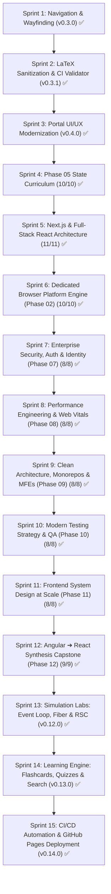

# Engineering Handbook & Learning Portal: Sprint Execution Plan & Agent Handover

> **Authoritative Multi-Agent Roadmap & Progress Tracker**  
> **Repository:** `react-interview-prep`  
> **Active Subsystems:**  
> - Study Notes: `notes/phase-01` through `phase-07` (Single Source of Truth)  
> - Interactive Portal: `apps/portal` (React 19 + TypeScript 5.8 + Vite 8)  
> - Architecture Decision Records: [`docs/adr/`](../adr/README.md)  
> - Active Backlog & Bug Reports: [`docs/sdlc/backlog/backlog.md`](./backlog/backlog.md)  
> - Master Progress Metric: [`PROGRESS.md`](../../PROGRESS.md)  
> - Governance & Pedagogy: [`AGENTS.md`](../../AGENTS.md)  
> - Portal SDLC & Quality Gates: [`docs/sdlc/portal-sdlc.md`](./portal-sdlc.md)

---

## 1. Multi-Agent Handover Protocol (Read This First)

If you are an agent resuming this repository, execute this orientation:
1. **Check Active Sprint Status:** Review Section 2 below to identify the currently active sprint.
2. **Consult ADRs:** Check [`docs/adr/`](../adr/README.md) before making architectural choices (e.g. ADR-001 for markdown SSOT, ADR-002 for typography/diagram layout, ADR-003 for publication workflow).
3. **Verify Quality Gates:** Run the verification pipeline before and after any changes:
   ```powershell
   cd apps/portal
   npm run manifest     # Syncs notes to public/notes and regenerates manifest.json
   npm test             # Validates manifest integrity and simulation lab files
   npx tsc --noEmit     # Validates TypeScript compilation
   npm run build        # Verifies production bundle build
   ```
4. **Inspect Dev Server:** Dev server runs on `http://localhost:5173/`.

---

## 2. Sprint Roadmap & Execution Board



| Sprint | Goal & Scope | Status | Primary Skill | Deliverables |
| :--- | :--- | :--- | :--- | :--- |
| **Sprint 1** | **Core Wayfinding & History Navigation (`apps/portal`)** | [x] **Complete** (v0.3.0) | `portal-developer` | Breadcrumbs (`FEAT-NAV-01`), Navigation History Stack (`FEAT-NAV-02`), Browser `popstate` sync, Sequential Next/Prev Cards (`FEAT-NAV-03`), Section Anchor Jumps (`FEAT-NAV-04`). |
| **Sprint 2** | **Formatting Cleanup, LaTeX Sanitization & CI Validator** | [x] **Complete** (v0.3.1) | `portal-developer` / `generate-markdown` | Sanitized raw LaTeX across all notes; added markdown preprocessor in `TopicReader.tsx`; added CI test in `test-manifest-integrity.mjs`. |
| **Sprint 3** | **Portal UI/UX Modernization & Defect Resolution** | [x] **Complete** (v0.4.0) | `portal-developer` | TOC sync, sticky sidebar, diagram SVG bounding, uniform badges (`[01]`, `[02]`, `[AC]`), 780px reading container, micro-animations, Back to Top button. |
| **Sprint 4** | **Phase 05 Curriculum Completion (Advanced State)** | [x] **Complete** | `generate-markdown` | Published 7 publication-grade 20-section chapters (Topics 04–10: TanStack Query, Cache Invalidation, Reselect, URL State, WebSockets, XState, Offline Persistence). Manifest indexed (41 topics). CI passed 100%. |
| **Sprint 5** | **Phase 06 Full Publication (Next.js & Full-Stack React)** | [x] **Complete** | `generate-markdown` | Authored 11 publication-grade chapters (Topics 00–10: Rosetta Stone, App Router, RSC Flight Wire Format, Server Actions, SSG/ISR, Edge Middleware, Next.js Auth & RBAC, Route Handlers, Multi-Tier Caching, Dynamic Imports/Turbopack, Docker Standalone & OpenTelemetry). Manifest indexed (52 topics). CI passed 100%. |
| **Sprint 6** | **Phase 02 Dedicated Browser Platform Engine** | [x] **Complete** (v0.5.0) | `generate-markdown` | Authored 10 publication-grade chapters covering Browser Architecture, DOM/CSSOM, Rendering Pipeline, Layout Thrashing, Event Propagation & Delegation, Network Stack, CORS/CSP, Browser Storage, and Service Workers/PWA. Manifest indexed (62 topics). CI passed 100%. |
| **Sprint 7** | **Phase 07 Enterprise Security, Auth & Identity** | [x] **Complete** (v0.6.0) | `generate-markdown` | Authored 8 publication-grade chapters covering OAuth2/OIDC, PKCE Flow, Microsoft Entra ID (Azure AD), JWT Storage Security, Session & Refresh Token Rotation, RBAC/ABAC Route Protection, CSP Level 3 Nonce Generation, and Frontend OWASP Top 10. Manifest indexed (70 topics). CI passed 100%. |
| **Sprint 8** | **Phase 08 Performance Engineering & Web Vitals** | [x] **Complete** (v0.7.0) | `generate-markdown` | Authored 8 publication-grade chapters covering Core Web Vitals (INP/LCP/CLS/TTFB), Chrome DevTools Flamechart Profiling, Memory Leaks & V8 Heap Snapshots, Main Thread Yielding (`scheduler.yield()`), Bundle Tree-Shaking, Image/Font Pipelines, Table Virtualization, and Real-User Monitoring (RUM). Manifest indexed (78 topics). CI passed 100%. |
| **Sprint 9** | **Phase 09 Clean Architecture, Monorepos & Micro-Frontends** | [x] **Complete** (v0.8.0) | `generate-markdown` / `portal-developer` | Authored 8 publication-grade chapters (Domain-Driven Design, Nx vs Turborepo, Shared Libraries & SemVer, Module Federation, Design System Tokens & Headless UI, Feature-Sliced Design, Scalable State & DI Repositories, Strangler Fig Monolith Refactoring). Implemented `ArchitectureLab` visualizer in `apps/portal`. Manifest indexed (86 topics). CI passed 100%. |
| **Sprint 10** | **Phase 10 Modern Testing Strategy & QA** | [x] **Complete** (v0.9.0) | `generate-markdown` / `portal-developer` | Authored 8 publication-grade chapters (Modern Testing Pyramid, Vitest Runner Architecture, React Testing Library Philosophy, Mock Service Worker MSW v2, Testing Async Hooks & Stores, Integration Testing Complex Workflows, Playwright E2E Architecture, Visual Regression & CI Quality Gates). Implemented `TestingLab` in `apps/portal`. Manifest indexed (94 topics). CI passed 100%. |
| **Sprint 11** | **Phase 11 Frontend System Design at Scale** | [x] **Complete** (v0.10.0) | `generate-markdown` / `portal-developer` | Authored 8 publication-grade chapters (System Design Framework, Collaborative Canvas CRDTs, HFT Telemetry Terminal, Multi-Tenant SaaS Dashboard, Global Media Player, BFF vs API Gateway, Offline-First Field App, Global CDN Edge Caching). Implemented `CanvasDesignLab` in `apps/portal`. Manifest indexed (102 topics). CI passed 100%. |
| **Sprint 12** | **Phase 12 Angular to React Enterprise Synthesis (Capstone)** | [x] **Complete** (v0.11.0) | `generate-markdown` | Authored 9 publication-grade chapters (Topics 00–08) providing 1-to-1 migration playbooks between Angular patterns (Zone.js, Signals, RxJS, DI, NgRx) and React/Next.js clean architecture. Manifest indexed (110 topics). CI passed 100%. |
| **Sprint 13** | **Interactive Simulation Labs: Event Loop, Fiber & RSC** | [x] **Complete** (v0.12.0) | `portal-developer` | Implemented Lab 04 (4-Lane Event Loop & INP Simulator), Lab 14 (Fiber Linked-List Work Loop & Key Diffing), and Lab 19 (RSC Flight Wire Format Stream Parser) in `VisualizerHub.tsx`. CI passed 100%. |
| **Sprint 14** | **Portal Learning Engine: Flashcards, Quizzes & Search** | [x] **Complete** (v0.13.0) | `portal-developer` | Implemented Flashcards Arena (`FEAT-LEARN-01`) with memory anchors, Staff Scenario Quizzes (`FEAT-LEARN-02`), and Global Instant Full-Text Search (`FEAT-LEARN-03`) with `Ctrl+K`. CI passed 100%. |
| **Sprint 15** | **CI/CD Automation, GitHub Actions & Public Deployment** | [x] **Complete** (v0.14.0) | DevOps / Agent | Configured automated GitHub Actions CI/CD workflow (`.github/workflows/deploy.yml`) for automated manifest sync, test validation, typecheck, build, and static deployment (`FEAT-LEARN-04`). CI passed 100%. |

---

## 3. Sprint 3 Detailed Work Breakdown: Portal UI/UX Modernization (Complete - v0.4.0)

### Backlog Reference:
Items UI-01 through UI-05 in [`docs/sdlc/backlog/backlog.md`](./backlog/backlog.md).  
Architecture Reference: [`docs/adr/ADR-002`](../adr/ADR-002-portal-ux-typographic-reading-system.md).

### Tasks:
- [x] **TASK-UI-01 (TOC Navigation):** Unified heading slugification in `scripts/generate-manifest.mjs`, `TopicReader.tsx`, and `src/core/utils/slugify.ts`. Implemented offset smooth-scrolling with fallback element matching.
- [x] **TASK-UI-02 (Sticky TOC):** Fixed sticky layout on right sidebar (`position: sticky; top: 78px; maxHeight: calc(100vh - 96px); overflowY: auto`) and removed parent overflow clipping on `<main>`.
- [x] **TASK-UI-03 (Diagram Bounding):** Added `.mermaid svg` bounding rules (`max-height: 520px; width: 100%; object-fit: contain`) and prevented `foreignObject` label compression into narrow columns.
- [x] **TASK-UI-04 (Sidebar Consistency):** Created `formatTopicBadgeAndTitle()` utility rendering clean `[01]`, `[02]`, `[AC]` badge pills uniformly across all phases in both sidebar and dashboard.
- [x] **TASK-UI-05 (Prose Width & Typography):** Applied `prose-reading-container` (`max-width: 800px; margin: 0 auto;`) to markdown reading body. Polished line-height (`1.78`), font hierarchy, and alert box styles.
- [x] **TASK-UI-06 (Interactivity):** Added floating "Back to Top" action button, dashboard phase card hover lift, and smooth chapter entrance transitions.

---

## 4. Sprint 4 Detailed Work Breakdown: Phase 05 State Curriculum Completion (Complete)

### Curriculum Output:
- [x] **TASK-STATE-04:** Authored [`04-tanstack-query-server-state.md`](../../notes/phase-05-advanced-state-architecture/04-tanstack-query-server-state.md) (Server State vs Client State, QueryClient/Cache/Observer internals, Stale-While-Revalidate, GC vs Stale timers, structural sharing, Angular Resource/RxJS & .NET Distributed Caching).
- [x] **TASK-STATE-05:** Authored [`05-cache-invalidation-optimistic-ui.md`](../../notes/phase-05-advanced-state-architecture/05-cache-invalidation-optimistic-ui.md) (Pessimistic vs Optimistic lifecycles, 4-phase transaction contract, Ghost Rollback bug & `cancelQueries`, cache invalidation topologies, Angular NgRx Effects & .NET Unit of Work / Sagas).
- [x] **TASK-STATE-06:** Authored [`06-reselect-memoization-performance.md`](../../notes/phase-05-advanced-state-architecture/06-reselect-memoization-performance.md) (Derived state projections, Reselect 5.x `weakMapMemoize` Ephemeron trie, reference stability, multi-instance cache thrashing, Angular `computed()` & .NET LINQ deferred execution).
- [x] **TASK-STATE-07:** Authored [`07-url-state-management.md`](../../notes/phase-05-advanced-state-architecture/07-url-state-management.md) (URL as single source of truth, History API `pushState`/`replaceState`/`popstate`, type-safe `nuqs`, search throttling, History API rate limits, Angular Router & ASP.NET Core QueryString binders).
- [x] **TASK-STATE-08:** Authored [`08-realtime-websockets-sync.md`](../../notes/phase-05-advanced-state-architecture/08-realtime-websockets-sync.md) (Push vs Pull, SSE vs WebSockets, 60 FPS `requestAnimationFrame` ring buffer batching, TanStack Query cache patching, heartbeats, exponential backoff with jitter, Angular SignalR & ASP.NET Core SignalR Channels).
- [x] **TASK-STATE-09:** Authored [`09-state-machines-xstate.md`](../../notes/phase-05-advanced-state-architecture/09-state-machines-xstate.md) (Boolean Explosion elimination, David Harel Statecharts, XState v5 Actor model, guards, actions, invoked actors, Angular State Routing & .NET Stateless / MassTransit Sagas).
- [x] **TASK-STATE-10:** Authored [`10-offline-first-persistence.md`](../../notes/phase-05-advanced-state-architecture/10-offline-first-persistence.md) (Local-First architecture, IndexedDB vs localStorage, TanStack Query persistence pipeline with `idb-keyval`, FIFO mutation outbox, conflict resolution OCC vs LWW, Angular PWA & .NET SQLite / EF Core Offline).

---

## 5. Verification Checklist for Closing Sprints

Every sprint milestone must pass this automated checklist:
1. `npm run manifest` exits with code 0.
2. `npm test` passes 100% of assertions.
3. `npx tsc --noEmit` returns 0 compiler errors.
4. `npm run build` generates production bundle cleanly.
5. [`PROGRESS.md`](../../PROGRESS.md), [`docs/sdlc/sprint-plan.md`](./sprint-plan.md), and [`docs/sdlc/backlog/backlog.md`](./backlog/backlog.md) are synchronized.
